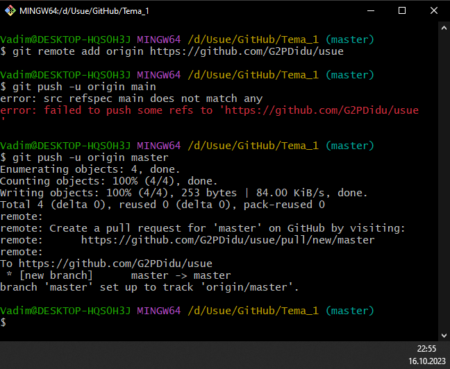
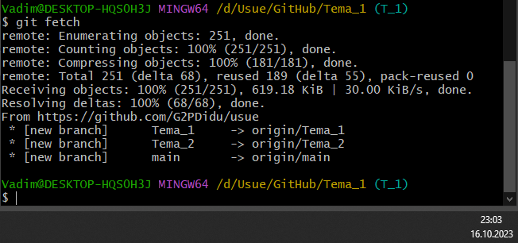
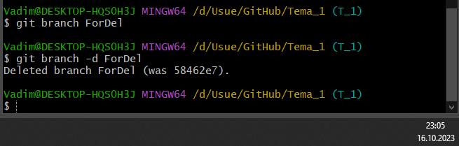
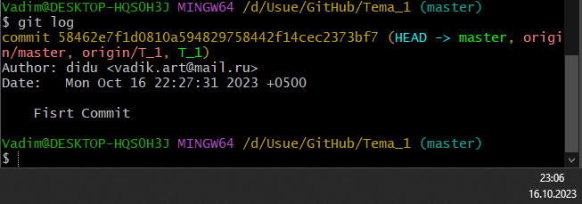

# Тема 1. Работа с Git
Отчет по Теме #1 выполнил(а):
- Артюшин Вадим Борисович
- ЗИВТ(ППК)-22-2-у

Работу проверили:
к.э.н., доцент Панов М.А.

## 2.1. Установка

## 2.2. Настройка

## 2.3. Создание нового репозитория

## 2.4. Подготовка файлов

## 2.5. Фиксация изменений

## 2.6. Подключение к удаленному репозиторию

## 2.7. Ветвление

## 2.8. Особенности применения «Фетч»

## 2.9. Удаление файлов, веток, локальных и удалённых репозиториев

## 2.10. Отслеживание изменений в коммитах

## 2.11. Возвращение файла к предыдущему (определенному) состоянию

## 2.12. Возвращение к предыдущему коммиту

## 2.13. Исправление коммита

## 2.14. Разрешение конфликтов при слиянии

## 2.15. Настройка .gitignore

Общий вывод:
Научился создавать репозитории, ветки, папки, файлы и загружать их удаленно через консоль Git Bash.
