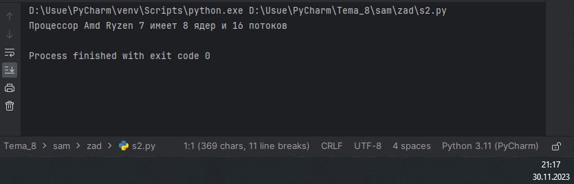

# Тема 10. Декораторы и исключения
Отчет по Теме #10 выполнил(а):
- Артюшин Вадим Борисович
- ОЗИВТ(ППК)-22-2-у

| Задание | Лаб_раб | Сам_раб |
| ------ | ------ | ------ |
| Задание 1 | + | + |
| Задание 2 | + | + |
| Задание 3 | + | + |
| Задание 4 | + | + |
| Задание 5 | + | + |
| Задание 6 | - | - |
| Задание 7 | - | - |
| Задание 8 | - | - |
| Задание 9 | - | - |
| Задание 10 | - | - |

знак "+" - задание выполнено; знак "-" - задание не выполнено;

Работу проверили:
- к.э.н., доцент Панов М.А.

## Лабораторная работа №1
### Наверняка вы думаете, что декораторы – это какая-то бесполезная вещь, которая вам никогда не пригодится, но тут вдруг на паре по математике преподаватель просит всех посчитать число Фибоначчи для 100. Кто-то будет считать вручную (так точно не нужно), кто-то посчитает на калькуляторе, а кто-то подумает, что он самый крутой и напишет рекурсивную программу на Python и немного огорчится, потому что данная программа будет достаточно долго считаться, если ее просто так запускать. Но именно тут к вам на помощь приходят декораторы, например @lru_cache (он предназначен для решения задач динамическим программированием, если простыми словами, то этот декоратор запоминает промежуточные результаты и при рекурсивном вызове функции программа не будет считать одни и те же значения, а просто “возьмёт их из этого декоратора”). Вам нужно написать программу, которая будет считать числа Фибоначчи для 100 и запустить ее без этого декоратора и с ним, посмотреть на разницу во времени решения поставленной задачи.

```python
from functools import lru_cache


@lru_cache(None)
def fibonacci(n):
    if n == 0:
        return 0
    elif n == 1:
        return 1
    return fibonacci(n - 1) + fibonacci(n - 2)

if __name__ == '__main__':
    print(fibonacci(100))
```

### Результат.


## Выводы
В данном коде выводятся одна строка с использованием функции `print()`. Каждая строка содержит разные значения:

1. `print(fibonacci(100))`: Выводится 354224848179261915075.

## Лабораторная работа №2
### Илья пишет свой сайт и ему необходимо сделать минимальную проверку ввода данных пользователя при регистрации. Для этого он реализовал функцию, которая выводит данные пользователя на экран и решил, что будет проверять правильность введённых данных при помощи декоратора, но в этом ему потребовалась ваша помощь. Напишите декоратор для функции, который будет принимать все параметры вызываемой функции (имя, возраст) и проверять чтобы возраст был больше 0 и меньше 130. Причем заметьте, что неважно сколько пользователь введет данных на сайт к Илье, будут обрабатываться только первые 2 аргумента.

```python
def check(input_func):
    def output_func(*args):
        name, age = args[0], args[1]

        if age < 0 or age > 130:
            age = 'Недопустимый возраст'
        input_func(name, age)

    return output_func

@check
def personal_info(name, age):
    print(f"Name: {name} Age: {age}")

if __name__ == '__main__':
    personal_info('Владимир', 38)
    personal_info('Александр', -5)
    personal_info('Петр', 138, 15, 48, 2)

```
### Результат.


## Выводы

В данном коде выводятся три строки с использованием функции `print()`. Каждая строка содержит разные значения:

1. `print(f"Name: {name} Age: {age}")`: Выводится Имена и возраст. 

## Лабораторная работа №3
### Вам понравилась идея Ильи с сайтом, и вы решили дальше работать вместе с ним. Но вот в вашем проекте появилась проблема, кто-то пытается сломать вашу функцию с получением данных для сайта. Эта функция работает только с данными integer, а какой-то недохакер пытается все сломать и вместо нужного типа данных отправляет string. Воспользуйтесь исключениями, чтобы неподходящий тип данных не ломал ваш сайт. Также дополнительно можете обернуть весь код функции в try/except/finally для того, чтобы программа вас оповестила о том, что выявлена какая-то ошибка или программа успешно выполнена.

```python
def data(*args):
    try:
        for i in range(len(*args)):
            try:
                result = (args[0][i] * 15) // 10
                print(result)
            except Exception as ex:
                print(ex)
    except Exception as ex:
        print(ex)
    finally:
        print('Вся информация обработана')

if __name__ == '__main__':
    data([1, 15, 'Hello', 'i', 'try', 'to', 'crash', 'your', 'site', 38, 45])
```
### Результат.


## Выводы

В данном коде выводятся одна строка с использованием функции `print()`. Каждая строка содержит разные значения:

1. `print(result)`: Выводится результат.


## Лабораторная работа №4
### Продолжая работу над сайтом, вы решили написать собственное исключение, которое будет вызываться в случае, если в функцию проверки имени при регистрации передана строка длиннее десяти символов, а если имя имеет допустимую длину, то в консоль выводиться “Успешная регистрация”.
```python
class NegativeValueException(Exception):
    pass

def check_name(name):
    if len(name) > 10:
        raise NegativeValueException('Длина более 10 символов')
    else:
        print('Успешная регистрация')

if __name__ == '__main__':
    name = '12345678910'
    check_name(name)
```
### Результат.


## Выводы

В данном коде выводятся две строки с использованием функции `print()`. Каждая строка содержит разные значения:

1. `print(f"Driving the {self.make} {self.model}")`: Выводится NegativeValueException: Длина более 10 символов.

## Лабораторная работа №5
### После запуска сайта вы поняли, что вам необходимо добавить логгер, для отслеживания его работы. Готовыми вариантами вы не захотели пользоваться, и поэтому решили создать очень простую пародию. Для этого создали две функции: __init__() (вызывается при создании класса декоратора в программе) и __call__() (вызывается при вызове декоратора). Создайте необходимый вам декоратор. Выведите все логи в консоль.

```python
class SiteChecker:
    def __init__(self, func):
        print('> Класс SiteChecker метод __init__ успешный запуск')
        self.func = func

    def __call__(self):
        print('> Проверка перед запууском', self.func.__name__)
        self.func()
        print('> Проверка безопасного выключения')


@SiteChecker
def site():
    print('Усердная работа сайта')

if __name__ == '__main__':
    print('>> Сайт запущен')
    site()
    print('>> Сайт выключен')
```
### Результат.


## Выводы

В данном коде выводятся одна строка с использованием функции `print()`. Каждая строка содержит разные значения:

1. `print('> Класс SiteChecker метод __init__ успешный запуск')`: Выводится Класс SiteChecker метод __init__ успешный запуск
2. `print('> Проверка перед запууском', self.func.__name__)`: Выводится Сайт запущен
3. `print('> Проверка безопасного выключения')`: Выводится Проверка перед запууском site
4. `print('Усердная работа сайта')`: Выводится Усердная работа сайта
5. `site()`: Выводится Проверка безопасного выключения
6. `print('>> Сайт выключен')`: Выводится выключен

## Самостоятельная работа №1
### Самостоятельно создайте класс и его объект. Они должны отличаться, от тех, что указаны в теоретическом материале (методичке) и лабораторных заданиях. Результатом выполнения задания будет листинг кода и получившийся вывод консоли.

```python
class CPU:
    def __init__(self, Brand, Models, Cores, Threads):
        self.Brand = Brand
        self.Models = Models
        self.Cores = Cores
        self.Threads = Threads

my_CPU = CPU("Amd", "Ryzen 7", "8", "16")
```
### Результат.


В данном коде выводятся одна строка с использованием функции `my_CPU`. Каждая строка содержит разные значения:

1. `my_CPU = CPU("Amd", "Ryzen 7", "8", "16")`.

## Самостоятельная работа №2
### Самостоятельно создайте атрибуты и методы для ранее созданного класса. Они должны отличаться, от тех, что указаны в теоретическом материале (методичке) и лабораторных заданиях. Результатом выполнения задания будет листинг кода и получившийся вывод консоли.

```python
class CPU:
    def __init__(self, Brand, Models, Cores, Threads):
        self.Brand = Brand
        self.Models = Models
        self.Cores = Cores
        self.Threads = Threads

    def Test_CPU(self):
        print(f"Процессор {self.Brand} {self.Models} имеет {self.Cores} ядер и {self.Threads} потоков")

my_CPU = CPU("Amd", "Ryzen 7", "8", "16")
my_CPU.Test_CPU()
```
### Результат.


## Выводы

В данном коде выводятся одна строка с использованием функции `print()`. Каждая строка содержит разные значения:

1. `print(f"Процессор {self.Brand} {self.Models} имеет {self.Cores} ядер и {self.Threads} потоков")`: Выводится предложение. 
  
## Самостоятельная работа №3
### Самостоятельно реализуйте наследование, продолжая работать с ранее созданным классом. Оно должно отличаться, от того, что указано в теоретическом материале (методичке) и лабораторных заданиях. Результатом выполнения задания будет листинг кода и получившийся вывод консоли.

```python
class CPU:
    def __init__(self, Brand, Models, Cores, Threads):
        self.Brand = Brand
        self.Models = Models
        self.Cores = Cores
        self.Threads = Threads

    def Test_CPU(self):
        print(f"Процессор {self.Brand} {self.Models} имеет {self.Cores} ядер и {self.Threads} потоков")


my_CPU = CPU("Amd", "Ryzen 7", "8", "16")
my_CPU.Test_CPU()


class Intel_CPU(CPU):
    def __init__(self, Brand, Models, Cores, Threads, TurboBoost):
        super().__init__(Brand, Models, Cores, Threads)
        self.TurboBoost = TurboBoost

    def boost(self):
        print(f"Процессор {self.Brand} {self.Models} имеет {self.TurboBoost} версии")

al_CPU = Intel_CPU("Intel", "i7-8700", "6", "8", "2.0")
al_CPU.Test_CPU()
al_CPU.boost()
```
### Результат.


## Выводы

В данном коде выводятся две строки с использованием функции `print()`. Каждая строка содержит разные значения:

1. `print(f"Процессор {self.Brand} {self.Models} имеет {self.Cores} ядер и {self.Threads} потоков")`: Выводится предложение.
2. `print(f"Процессор {self.Brand} {self.Models} имеет {self.TurboBoost} версии")`: Выводится предложение. 
  
## Самостоятельная работа №4
### Самостоятельно реализуйте инкапсуляцию, продолжая работать с ранее созданным классом. Она должна отличаться, от того, что указана в теоретическом материале (методичке) и лабораторных заданиях. Результатом выполнения задания будет листинг кода и получившийся вывод консоли.
```python
class CPU:
    def __init__(self, Brand, Models, Cores, Threads):
        self._Brand = Brand
        self.__Models = Models
        self.___Cores = Cores
        self.____Threads = Threads

    def Test_CPU(self):
        print(f"Процессор {self._Brand} {self.__Models} имеет {self.___Cores} ядер и {self.____Threads} потоков")

my_CPU = CPU("Amd", "Ryzen 7", "8", "16")
print(my_CPU._Brand)
my_CPU.Test_CPU()
```
### Результат.


## Выводы

В данном коде выводятся две строки с использованием функции `print()`. Каждая строка содержит разные значения:

1. `print(f"Процессор {self._Brand} {self.__Models} имеет {self.___Cores} ядер и {self.____Threads} потоков")`: Выводится предложение.
2. `print(my_CPU._Brand)`: Выводится функция.
  
## Самостоятельная работа №5
### Самостоятельно реализуйте полиморфизм. Он должен отличаться, от того, что указан в теоретическом материале (методичке) и лабораторных заданиях. Результатом выполнения задания будет листинг кода и получившийся вывод консоли.

```python
class Camera:
    def take_picture(self):
        print('фотографирую')

    def get_resolution(self):
        print('разрешение недоступно')


class Phone:
    def call(self):
        print('зовущий')

    def charge(self):
        print('зарядка')

class CameraPhone(Camera, Phone):
    pass

camera_phone = CameraPhone()
camera_phone.take_picture()
camera_phone.get_resolution()
camera_phone.call()
camera_phone.charge()
```
### Результат.

  
## Выводы

В данном коде выводятся одна строка с использованием функции `print()`. Каждая строка содержит разные значения:

1. `print('фотографирую')`: Выводится фотографирую.
2. `print('разрешение недоступно')`: Выводится разрешение недоступно.
3. `print('зовущий')`: Выводится зовущий.
4. `print('зарядка')`: Выводится зарядка.

## Общие выводы по теме
Декораторы в Python используются для добавления дополнительного поведения к функциям или методам без изменения их исходного кода. Декоратор - это функция, которая принимает функцию в качестве аргумента и возвращает преобразованную функцию. Декораторы позволяют изменять поведение функции во время выполнения, например, добавить логирование вызовов или проверку аргументов. Исключения в Python используются для обработки ошибок и неожиданных ситуаций во время выполнения программы. Когда возникает ошибка, программа может выдать сообщение об ошибке и завершить работу или же обработать исключение с помощью блока try-except. В Python есть несколько встроенных исключений, таких как IndexError, TypeError и ValueError, которые возникают при определенных условиях. Вы также можете создать свои собственные исключения, если стандартные не подходят для вашей ситуации. 
