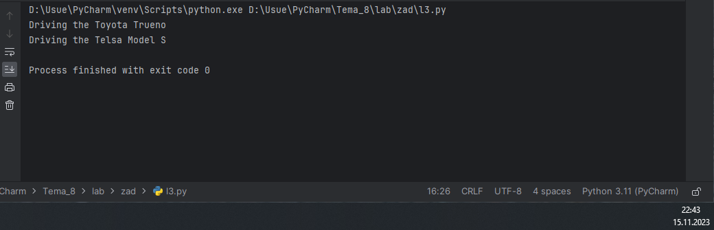
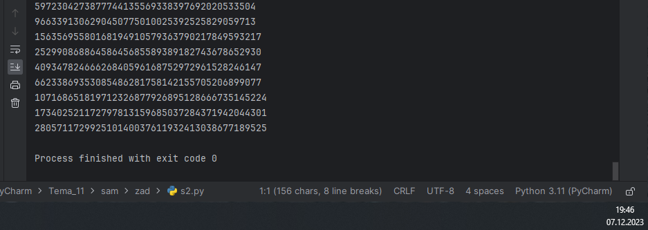
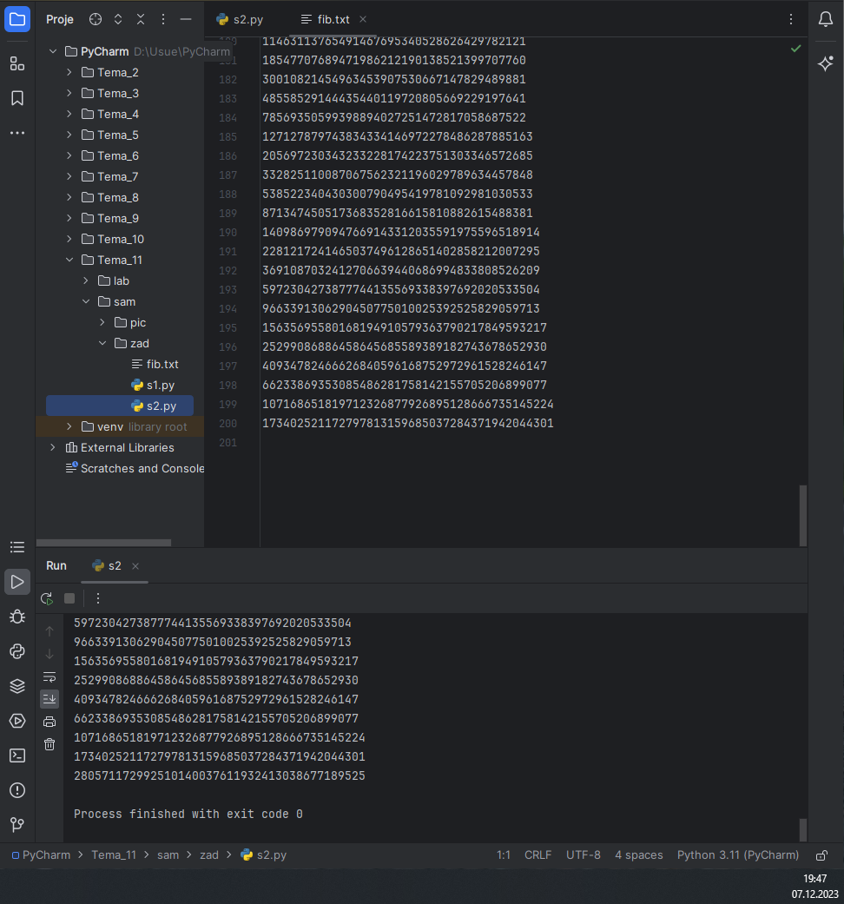

# Тема 11. Итераторы и генераторы.
Отчет по Теме #11 выполнил(а):
- Артюшин Вадим Борисович
- ОЗИВТ(ППК)-22-2-у

| Задание | Лаб_раб | Сам_раб |
| ------ | ------ | ------ |
| Задание 1 | + | + |
| Задание 2 | + | + |
| Задание 3 | + | - |
| Задание 4 | + | - |
| Задание 5 | + | - |
| Задание 6 | - | - |
| Задание 7 | - | - |
| Задание 8 | - | - |
| Задание 9 | - | - |
| Задание 10 | - | - |

знак "+" - задание выполнено; знак "-" - задание не выполнено;

Работу проверили:
- к.э.н., доцент Панов М.А.

## Лабораторная работа №1
### Простой итератор, но у него нет гибкой настройки, например его нельзя развернуть. Он работает просто как next(), но нет prev().

```python
numbers = [0, 1, 2, 3, 4, 5]
for item in numbers:
    print(item)
```

### Результат.


## Выводы
В данном коде выводятся одна строка с использованием функции `my_car`. Каждая строка содержит разные значения:

1. `print(item)`: выводится 

## Лабораторная работа №2
### Класс итератор с гибкой настройкой и удобными применением.

```python
class CountDown:
    def __init__(self, start):
        self.count = start + 1

    def __iter__(self):
        return self

    def __next__(self):
        self.count -= 1
        if self.count < 0:
            raise StopIteration
        return self.count

if __name__ == '__main__':
    counter = CountDown(5)
    for i in counter:
        print(i)
```
### Результат.


## Выводы

В данном коде выводятся одна строка с использованием функции `print()`. Каждая строка содержит разные значения:

1. `print(f"Driving the {self.make} {self.model}")`: Выводится предложение. 

## Лабораторная работа №3
### Генератор списка.

```python
a = [i ** 2 for i in range(1, 5)]

print('a - ', a)
for i in a:
    print(i)

print('iter(a) - ', iter(a))
for i in a:
    print(i)
```
### Результат.


## Выводы

В данном коде выводятся две строки с использованием функции `print()`. Каждая строка содержит разные значения:

1. `print(f"Driving the {self.make} {self.model}")`: Выводится предложение.
2. `print(f"Charging the {self.make} {self.model} with {self.battery_capacity}  kWh")`: Выводится предложение. 


## Лабораторная работа №4
### Выражения генераторы.

```python
b = (i ** 2 for i in range(1, 5))
print(b)
print('first')
for i in b:
    print(i)
print('second')
for i in b:
    print(i)
```
### Результат.


## Выводы

В данном коде выводятся две строки с использованием функции `print()`. Каждая строка содержит разные значения:

1. `print(f"Driving the {self.make} {self.model}")`: Выводится предложение.
2. `print(my_car.make)`: Выводится функция.

## Лабораторная работа №5
### Такой же счетчик, как и в первом задании, только это генератор и использует yield.

```python
def countdown(count):
    while count >= 0:
        yield count
        count -= 1

if __name__ == '__main__':
    counter = countdown(5)
    for i in counter:
        print(i)
```
### Результат.


## Выводы

В данном коде выводятся одна строка с использованием функции `print()`. Каждая строка содержит разные значения:

1. `print(shape.area())`: Выводится площадь текущей фигуры (shape) с помощью вызова метода area() для текущего объекта.

## Самостоятельная работа №1
### Вас никак не могут оставить числа Фибоначчи, очень уж они вас заинтересовали. Изучив новые возможности Python вы решили реализовать программу, которая считает числа Фибоначчи при помощи итераторов. Расчет начинается с чисел 1 и 1. Создайте функцию fib(n), генерирующую n чисел Фибоначчи с минимальными затратами ресурсов. Для реализации этой функции потребуется обратиться к инструкции yield (Она не сохраняет в оперативной памяти огромную последовательность, а дает возможность “доставать” промежуточные результаты по одному). Результатом решения задачи будет листинг кода и вывод в консоль с числом Фибоначчи от 200.

```python
def fib(n):
    a, b = 0, 1
    for _ in range(n):
        a, b = b, a + b
        yield a

# Пример использования
for number in fib(200):
    print(number)
```
### Результат.


В данном коде выводятся одна строка с использованием функции `my_CPU`. Каждая строка содержит разные значения:

1. `my_CPU = CPU("Amd", "Ryzen 7", "8", "16")`.

## Самостоятельная работа №2
### К коду предыдущей задачи добавьте запоминание каждого числа Фибоначчи в файл “fib.txt”, при этом каждое число должно находиться на отдельной строчке. Результатом выполнения задачи будет листинг кода и скриншот получившегося файла.

```python
def fib(n):
    a, b = 0, 1
    for _ in range(n):
        a, b = b, a + b
        yield a

# Пример использования
for number in fib(200):
    print(number)

def write_fibs_to_file(n):
    file = open("fib.txt", "w")
    a, b = 0, 1
    for _ in range(n):
        file.write(str(a) + "\n")
        a, b = b, a + b
    file.close()

#Пример использования
write_fibs_to_file(200)
```
### Результат.



## Выводы

В данном коде выводятся одна строка с использованием функции `print()`. Каждая строка содержит разные значения:

1. `print(number)`: Выводится числа. 
  
## Общие выводы по теме
Python позволяет работать с файлами различными способами, такими как чтение, запись, добавление и удаление данных. Для работы с файлами можно использовать встроенные функции, такие как open(), close() и read(), или модули, такие как os и io. Кроме того, Python поддерживает различные режимы доступа к файлам, такие как “r” для чтения, “w” для записи и “a” для добавления данных.
