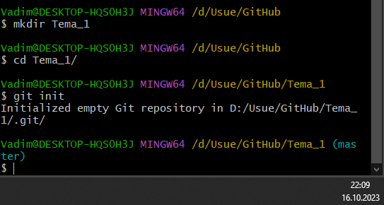
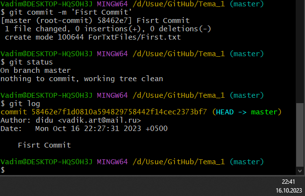

# Тема 2. Базовые операции языка Python
Отчет по Теме #2 выполнил(а):
- Артюшин Вадим Борисович
- ОЗИВТ(ППК)-22-2-у

| Задание | Лаб_раб | Сам_раб |
| ------ | ------ | ------ |
| Задание 1 | + | + |
| Задание 2 | + | + |
| Задание 3 | + | + |
| Задание 4 | + | + |
| Задание 5 | + | + |
| Задание 6 | + | + |
| Задание 7 | + | + |
| Задание 8 | + | + |
| Задание 9 | + | + |
| Задание 10 | + | + |

знак "+" - задание выполнено; знак "-" - задание не выполнено;

Работу проверили:
- к.э.н., доцент Панов М.А.

## Лабораторная работа №1
### Выведите в консоль три строки. Первая – любое число. Вторая – любое число в виде строки. Третья – любое число с плавающей точкой.

```python
print(2077)
print('2077')
print(2.077)
```
### Результат.


## Выводы

В данном коде выводятся три строки с использованием функции `print()`. Каждая строка содержит разные значения:

1. `print(2077)`: Выводится целое число 2077. 

2. `print('2077')`: Выводится строка '2077', так как она заключена в одинарные кавычки.

3. `print(2.077)`: Выводится число с плавающей точкой 2.077.

## Лабораторная работа №2
### Выведите в консоль три строки. Первая – результат сложения или вычитания минимум двух переменных типа int. Вторая – результат сложения или вычитания минимум двух переменных типа float. Третья – результат сложения или вычитания минимум двух переменных типа int и float.

```python
print(211 + 412)
print(6.1 - 1.7)
print(9 - 1.1 + 3 - 2.12)
```
### Результат.


## Выводы

В данном коде выводятся три строки с использованием функции `print()`. Каждая строка содержит разные значения:

1. `print(211 + 412)`: Выводится результат операции сложения двух переменных типа int. 

2. `print(6.1 - 1.7)`: Выводится результат операции вычетания двух переменных типа float.

3. `print(9 - 1.1 + 3 - 2.12)`: Выводится результат операции сложения и вычетания двух переменных типа int и float.

## Лабораторная работа №3
### Выведите в консоль три строки. Первая – обычная строка. Вторая – F строка с использованием заранее объявленной переменной. Третья – сложите две или более строк в одну.

```python
print('Privet, Mir!')

world = 'Mir'
print(f"Privet, {world}!")

one = 'Privet, '
two = 'Mir!'
print(one+two)
```
### Результат.


## Выводы

В данном коде выводятся три строки с использованием функции `print()`. Каждая строка содержит разные значения:

1. `print('Privet, Mir!')`: Выводится строка. 

2. `world = 'Mir'
   print(f"Privet, {world}!")`: Выводится результат с использованием заранее объявленной переменной.

3. `one = 'Privet, '
two = 'Mir!'
print(one+two)`: Выводится результат сложиние двух строк в одну.

  
## Лабораторная работа №4
### Выведите в консоль три строки. Первая – трансформация любого типа переменной в bool. Вторая – трансформация любого типа переменной в float или int. Третья – трансформация любого типа переменной в str.

```python
one = 'Hello'
print(bool(one))

two = 212
print(float(two))

three = None
print(str(three))
```
### Результат.


## Выводы

В данном коде выводятся три строки с использованием функции `print()`. Каждая строка содержит разные значения:

1. `one = 'Hello'
print(bool(one))`: Выводится результат трансформации переменной в boolа. 

2. `two = 212
print(float(two))`: Выводится результат трансформации переменной int.

3. `three = None
print(str(three))`: Выводится результат трансформации переменной в str.

## Лабораторная работа №5
### Присвойте трем переменным различные значения, воспользовавшись функцией input()

```python
one = input('one:')
two = input('two:')
three = input('three:')
print(one, two, three)
```
### Результат.


## Выводы

В данном коде выводятся четыре строки с использованием функции `print()`. Каждая строка содержит разные значения:

1. `one = input('one:')`: Выводится результат ввода переменной с клавиатуры на экран. 

2. `two = input('two:')`: Выводится результат ввода переменной с клавиатуры на экран.

3. `three = input('three:')`: Выводится результат ввода переменной с клавиатуры на экран.

4. `print(one, two, three)`: Выводится результат общий результат ввывода.

## Лабораторная работа №6
### Создайте две любые числовые переменные и выполните над ними несколько математических операций: возведение в степень, обычное деление, целочисленное деление, нахождение остатка от деления. При желании вы можете проверить как работают эти вычисления с разными типами данных, например, сначала создать две переменные int, затем создать две переменные float и наконец создать переменные типа int и float и провести над ними операции, прописанные выше.

```python
a = 12
b = 5
print('Возведение в степень:', a ** b)
print('Обчное деление:', a / b)
print('Целочисленное деление:', a // b)
print('Нахождение остатка от деления:', a % b)
```
### Результат.


## Выводы

В данном коде выводятся четыре строки с использованием функции `print()`. Каждая строка содержит разные значения:

1. `print('Возведение в степень:', a ** b)`: Выводится результат возведения в степень.

2. `print('Обчное деление:', a / b)`: Выводится результат обчного деления.

3. `print('Целочисленное деление:', a // b)`: Выводится результат целочисленное деления.

4. `print('Нахождение остатка от деления:', a % b)`: Выводится результат нахождение остатка от деления.

## Лабораторная работа №7
### Создайте любую строковую переменную и произведите над ней математическое действие умножение на любое число.

```python
line = 'Hello!'
print(line * 6)
```
### Результат.


## Выводы

В данном коде выводятся одна строки с использованием функции `print()`. Каждая строка содержит разные значения:

1. `print(line * 6)`: Выводится результат повторения 6 раз. 

## Лабораторная работа №8
### Создайте любую строковую переменную и произведите над ней математическое действие умножение на любое число.

```python
sentence = 'Hello World'
print(sentence.count('o'))
```
### Результат.


## Выводы

В данном коде выводятся одна строки с использованием функции `print()`. Каждая строка содержит разные значения:

1. `print(sentence.count('o'))`: Выводится результат посчет двух букв О.

## Лабораторная работа №9
### Напишите предложение ‘Hello World’ в две строки. Написанная программа должна занимать одну строку в редакторе кода.

```python
print('Hello\nWorld')
```
### Результат.


## Выводы

В данном коде выводятся одна строки с использованием функции `print()`. Каждая строка содержит разные значения:

1. `print('Hello\nWorld')`: Выводится результат ‘Hello World’ в две строки.

## Лабораторная работа №10
### Из предложения ‘Hello World’ выведите в консоль только 2 символ, а затем выведите слово ‘Hello’

```python
sentence = 'Hello World'
print(sentence[1])
print(sentence[:5])
```
### Результат.


## Выводы

В данном коде выводятся две строки с использованием функции `print()`. Каждая строка содержит разные значения:

1. `print(sentence[1])`: Выводится вторая буква. 

2. `print(sentence[:5])`: Выводится слово Hello].

## Самостоятельная работа №1
### Выведите в консоль булевую переменную False, не используя слово False в строке или изначально присвоенную булевую переменную. Программа должна занимать не более двух строк редактора кода.

```python
true = 0
print(true == 0)
```
### Результат.


## Выводы

В данном коде выводятся одной строки с использованием функции `print()`. Каждая строка содержит разные значения:

1. `print(true == 0)`: Выводится результат True. 

## Самостоятельная работа №2
### Присвоить значения трем переменным и вывести их в консоль, используя только две строки редактора кода.

```python
a, b, c = 1, 2, 3
print(a, b, c)
```
### Результат.


## Выводы

В данном коде выводятся одной строки с использованием функции `print()`. Каждая строка содержит разные значения:

1. `print(a, b, c)`: Выводится результат трех перемернных. 
  
## Самостоятельная работа №3
### Реализуйте ввод данных в программу, через консоль, в виде только целых чисел (тип данных int). То есть при вводе буквенных символов в консоль, программа не должна работать. Программа должна занимать не более двух строк редактора кода.

```python
A = int(input('Введите число: '))
print(A)
```
### Результат.


## Выводы

В данном коде выводятся одной строки с использованием функции `print()`. Каждая строка содержит разные значения:

1. `print(A)`: Выводится результат переменной. 
  
## Самостоятельная работа №4
### Создайте только одну строковую переменную. Длина строки должна не превышать 5 символов. На выходе мы должны получить строку длиной не менее 16 символов. Программа должна занимать не более двух строк редактора кода.

```python
a = '2077 '
print(a * 4)
```
### Результат.


## Выводы

В данном коде выводятся одной строки с использованием функции `print()`. Каждая строка содержит разные значения:

1. `print(a * 4)`: Выводится результат переменной четыре раза. 
  
## Самостоятельная работа №5
### Создайте три переменные: день (тип данных - числовой), месяц (тип данных - строка), год (тип данных - числовой) и выведите в консоль текущую дату в формате: “Сегодня день месяц год. Всего хорошего!” используя F строку и оператор end внутри print(), в котором вы должны написать фразу “Всего хорошего!”. Программа должна занимать не более двух строк редактора кода.

```python
a = int(input('Введите день: ')); b = input('Введите месяц: '); c = int(input('Введите год: '))
print('Сегодня ' f'{a} {b} {c}' ' Всего хорошего!')
```
### Результат.


## Выводы

В данном коде выводятся одной строки с использованием функции `print()`. Каждая строка содержит разные значения:

1. `print('Сегодня ' f'{a} {b} {c}' ' Всего хорошего!')`: Выводится предложение. 
  
## Самостоятельная работа №6
### В предложении ‘Hello World’ вставьте ‘my’ между двумя словами. Выведите полученное предложение в консоль в одну строку. Программа должна занимать не более двух строк редактора кода.

```python
a = 'Hello'; b = ' my '; c = 'World';
print(a + b + c)
```
### Результат.


## Выводы

В данном коде выводятся одной строки с использованием функции `print()`. Каждая строка содержит разные значения:

1. `print(a + b + c)`: Выводится предложение. 
  
## Самостоятельная работа №7
### Узнайте длину предложения ‘Hello World’, результат выведите в консоль. Программа должна занимать не более двух строк редактора кода.

```python
print(len('Hello World'))
```
### Результат.


## Выводы

В данном коде выводятся одной строки с использованием функции `print()`. Каждая строка содержит разные значения:

1. `print(len('Hello World'))`: Выводится длина строки. 
  
## Самостоятельная работа №8
### Переведите предложение ‘HELLO WORLD’ в нижний регистр. Программа должна занимать не более двух строк редактора кода.

```python
print('HELLO WORLD'.lower())
```
### Результат.


## Выводы

В данном коде выводятся одной строки с использованием функции `print()`. Каждая строка содержит разные значения:

1. `print('HELLO WORLD'.lower())`: Выводится результат в нижнем регистре. 
  
## Самостоятельная работа №9
### Самостоятельно придумайте задачу по проходимой теме и решите ее. Задача должна быть связана со взаимодействием с числовыми значениями.

```python
a1 = int(input('Введите первое число: '))
b1 = int(input('Введите второе число: '))
print('Сумма чисел: ', a1 + b1)
```
### Результат.


## Выводы

В данном коде выводятся одной строки с использованием функции `print()`. Каждая строка содержит разные значения:

1. `print('Сумма чисел: ', a1 + b1)`: Выводится сумма чисел. 
  
## Самостоятельная работа №10
### Самостоятельно придумайте задачу по проходимой теме и решите ее. Задача должна быть связанна со взаимодействием со строковыми значениями.

```python
name = input("Введите ваше имя: ")
print("Здравствуйте, " + name + '!')
```
### Результат.


## Выводы

В данном коде выводятся одной строки с использованием функции `print()`. Каждая строка содержит разные значения:

1. `print("Здравствуйте, " + name + '!')`: Выводится результат предложения. 

## Общие выводы по теме
- Развернутый вывод
