# Тема 4. функции и стандартные модули/библеотеки.
Отчет по Теме #3 выполнил(а):
- Артюшин Вадим Борисович
- ОЗИВТ(ППК)-22-2-у

| Задание | Лаб_раб | Сам_раб |
| ------ | ------ | ------ |
| Задание 1 | + | + |
| Задание 2 | + | + |
| Задание 3 | + | + |
| Задание 4 | + | + |
| Задание 5 | + | + |
| Задание 6 | + | - |
| Задание 7 | + | - |
| Задание 8 | + | - |
| Задание 9 | + | - |
| Задание 10 | + | - |

знак "+" - задание выполнено; знак "-" - задание не выполнено;

Работу проверили:
- к.э.н., доцент Панов М.А.

## Лабораторная работа №1
### Создайте две переменные, значение которых будете вводить через консоль. Также составьте условие, в котором созданные ранее переменные будут сравниваться, если условие выполняется, то выведете в консоль «Выполняется», если нет, то «Не выполняется».

```python
def main():
    print(2+2)

if __name__ == '__main__':
    main()
```
### Результат.
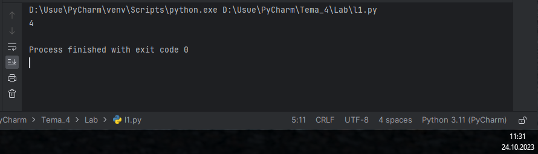

## Выводы

В данном коде выводятся одна строки с использованием функции `print()`. Каждая строка содержит разные значения:

1. `print('Выполняется')`: Выводится "Выполняется". 


## Лабораторная работа №2
### Напишите программу, которая будет определять значения переменной меньше 0, больше 0 и меньше 10 или больше 10. Это нужно реализовать при помощи одной переменной, значение которой будет вводится через консоль, а также при помощи конструкций if, elif, else.

```python
ft = int(input('Введите переменую: '))
if ft < 0:
    print('Переменная меньше 0')
elif 0 < ft < 10:
    print('Переменная больше 0 и меньше 10')
else:
    print('Переменная больше 10')
```
### Результат.
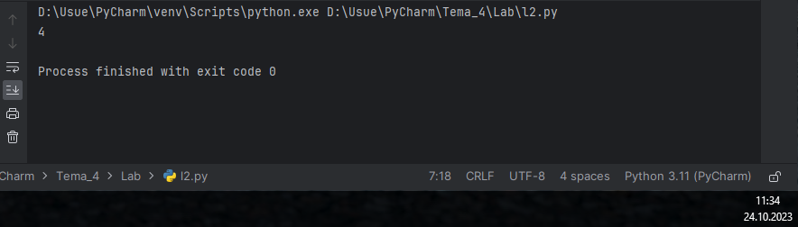

## Выводы

В данном коде выводятся три строки с использованием функции `print()`. Каждая строка содержит разные значения:

1. `print('Переменная меньше 0')`: Выводится при условии что переменная меньше 0. 

2. ` print('Переменная больше 0 и меньше 10')`: Выводится при условии что переменная больше 0 и меньше 10.

3. `print('Переменная больше 10')`: Выводится при условии что переменная больше 10.

## Лабораторная работа №3
### Напишите программу, в которой будет проверяться есть ли переменная в указанном массиве используя логический оператор in. Самостоятельно посмотрите, как работает программа со значениями которых нет в массиве numbers.

```python
numbers = [1, 3, 5, 7, 9]
value = int(input('Введите переменную: '))
if value in numbers:
    print('Переменная есть в данном массиве')
else:
    print('Переменной нет в этом массиве')
```
### Результат.
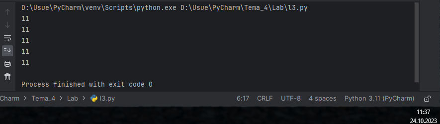

## Выводы

В данном коде выводятся две строки с использованием функции `print()`. Каждая строка содержит разные значения:

1. `print('Переменная есть в данном массиве')`: Выводится при условии что переменная есть в данном массиве. 

2. `print('Переменной нет в этом массиве')`: Выводится при условии что переменной нет в этом массиве.
  
## Лабораторная работа №4
### Напишите программу, которая будет определять находится ли переменная в указанном массиве и если да, то проверьте четная она или нет. Самостоятельно протестируйте данную программу с разными значениями переменной value.

```python
numbers = [1, 3, 5, 7, 9, 12, 15, 18, 27, 317]
value = int(input('Введите переменную: '))
if value in numbers:
    if value % 2 == 0:
        print('Переменная четная и есть в массиве numbers')
    else:
        print('Переменная нечетная и есть в массиве numbers')
else:
    print(f"Переменной нет в массиве numbers и она равна {value}")
```
### Результат.
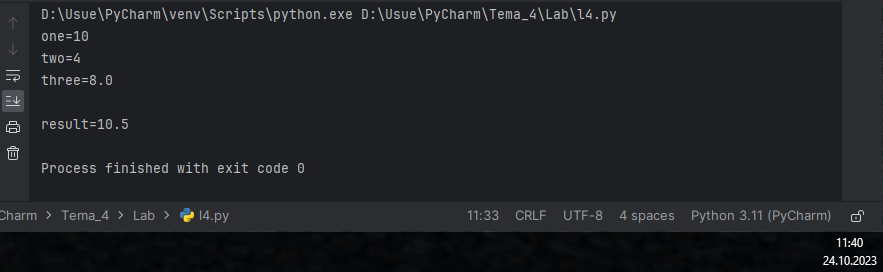

## Выводы

В данном коде выводятся три строки с использованием функции `print()`. Каждая строка содержит разные значения:

1. `print('Переменная четная и есть в массиве numbers')`: Выводится при условии что переменная четная и есть в массиве numbers. 

2. `print('Переменная нечетная и есть в массиве numbers')`: Выводится при условии что переменная нечетная и есть в массиве numbers.

3. `print(f"Переменной нет в массиве numbers и она равна {value}")`: Выводится при условии что переменной нет в массиве numbers и она равна {value}.

## Лабораторная работа №5
### Напишите программу, в которой циклом for значения переменной i будут меняться от 0 до 10 и посмотрите, как разные виды сравнений и операций работают в цикле.

```python
for i in range(10):
    print('i = ', i)
    if i == 0:
        i += 2
    if i == 1:
        continue
    if i == 2 or i == 3:
        print('Переменная равна 2 или 3')
    elif i in [4, 5, 6]:
        print('Переменная равна 4, 5 или 6')
    else:
        break
```
### Результат.
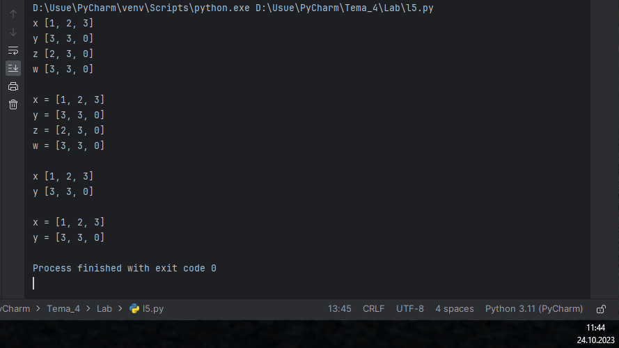

## Выводы

В данном коде выводятся три строки с использованием функции `print()`. Каждая строка содержит разные значения:

1. `print('i = ', i)`: Выводится переменная цикла. 

2. `print('Переменная равна 2 или 3')`: Выводится при условии что переменная равна 2 или 3.

3. `print('Переменная равна 4, 5 или 6')`: Выводится при условии что переменная равна 4, 5 или 6.

## Лабораторная работа №6
### Напишите программу, в которой при помощи цикла for определяется есть ли переменная value в строке string и посмотрите, как работает оператор else для циклов. Самостоятельно посмотрите, что выведет программа, если значение переменной value оказалось в строке string. Определять индекс буквы не обязательно, но если вы хотите, то это делается при помощи строки: index = string.find(value) Вы берете название переменной, в которой вы хотите что-то найти, затем применяете встроенный метод find() и в нем указываете то, что вам нужно найти. Данная строка вернет индекс искомого объекта.

```python
string = 'Лабораторная работа номер 3'
value = input('Ввведите букву которую хотите найти: ')
for i in string:
    if i == value:
        index = string.find(value)
        print(f"Буква '{value}' есть в строке под {index} индексом")
        break
    else:
        print(f"Буквы '{value}' нет в указанной строке")
```
### Результат.
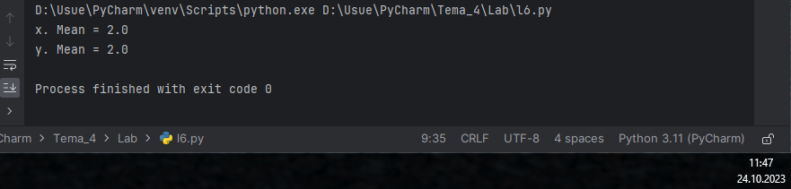

## Выводы

В данном коде выводятся две строки с использованием функции `print()`. Каждая строка содержит разные значения:

1. `print(f"Буква '{value}' есть в строке под {index} индексом")`: Выводится при условии что в слове присутствует введеная буква.

2. `print(f"Буквы '{value}' нет в указанной строке")`: Выводится при условии что в слове отсутствует введеная буква.

## Лабораторная работа №7
### Напишите программу, в которой вы наглядно посмотрите, как работает цикл for проходя в обратном порядке, то есть, к примеру не от 0 до 10, а от 10 до 0. В уже готовой программе показано вычитание из 100, а вам во время реализации программы будет необходимо придумать свой вариант применения обратного цикла.

```python
value = 100
for i in range(10, -1, -1):
    value -= i
    print(i, value)
```
### Результат.
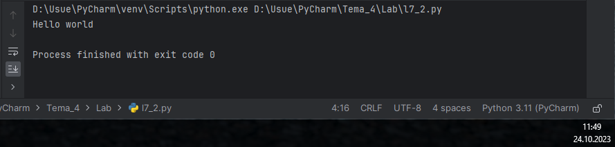

## Выводы

В данном коде выводятся одна строки с использованием функции `print()`. Каждая строка содержит разные значения:

1. `print(i, value)`: Выводится вычитание из заданного значения. 

## Лабораторная работа №8
### Напишите программу используя цикл while, внутри которого есть какие-либо проверки, но быть осторожным, поскольку циклы while при неправильно написанных условиях могут становится бесконечными, как указано в примере далее.

```python
value = 0
while value < 100:
    if value == 0:
        value += 10
    elif value // 5 > 1:
        value *= 5
    else:
        value -= 5
    print(value)
```
### Результат.
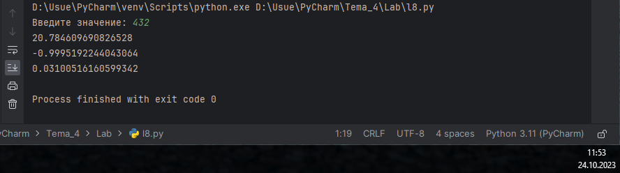

## Выводы

В данном коде выводятся одна строки с использованием функции `print()`. Каждая строка содержит разные значения:

1. `print(value)`: Выводится результат цикла.

## Лабораторная работа №9
### Напишите программу с использованием вложенных циклов и одной проверкой внутри них. Самое главное, не забудьте, что нельзя использовать одинаковые имена итерируемых переменных, когда вы используете вложенные циклы.

```python
value = 0
for i in range(10):
    for j in range(10):
        if i != j:
            value += j
        else:
            pass
print(value)
```
### Результат.
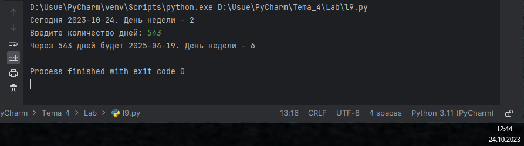

## Выводы

В данном коде выводятся одна строки с использованием функции `print()`. Каждая строка содержит разные значения:

1. `print(value)`: Выводится результат цикла.

## Лабораторная работа №10
### Напишите программу с использованием flag, которое будет определять есть ли нечетное число в массиве. В данной задаче flag выступает в роли индикатора встречи нечетного числа в исходном массиве, четных чисел.

```python
even_array = [2, 4, 6, 8, 9]
flag = False
for value in even_array:
    if value % 2 == 1:
        flag = True
if flag is True:
    print('В массиве есть нечетное число')
else:
    print('В массиве все числа четные')
```
### Результат.
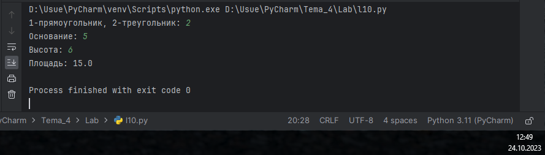

## Выводы

В данном коде выводятся две строки с использованием функции `print()`. Каждая строка содержит разные значения:

1. `print('В массиве есть нечетное число')`: Выводится при условии что в массиве есть нечетное число.

2. `print('В массиве все числа четные')`: Выводится при условии что в массиве все числа четные.

## Самостоятельная работа №1
### Напишите программу, которая преобразует 1 в 31. Для выполнения поставленной задачи необходимо обязательно и только один раз использовать:
•	Цикл for
•	*= 5
•	+= 1
Никаких других действий или циклов использовать нельзя.

```python
for x in range(7):
    x *= 5
    x += 1
print(x)
```
### Результат.
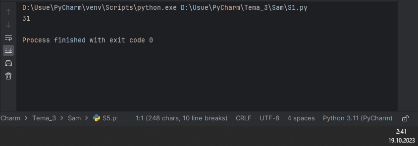

## Выводы

В данном коде выводятся одной строки с использованием функции `print()`. Каждая строка содержит разные значения:

1. `print(x)`: Выводится число 31. 

## Самостоятельная работа №2
### Напишите программу, которая фразу «Hello World» выводит в обратном порядке, и каждая буква находится в одной строке консоли. При этом необходимо обязательно использовать любой цикл, а также программа должна занимать не более 3 строк в редакторе кода.

```python
for c in "Hello World"[::-1]: print(c)
```
### Результат.


## Выводы

В данном коде выводятся одной строки с использованием функции `print()`. Каждая строка содержит разные значения:

1. `print(c)`: Выводится "Hello World" в обратном порядке. 
  
## Самостоятельная работа №3
### Напишите программу, на вход которой поступает значение из консоли, оно должно быть числовым и в диапазоне от 0 до 10 включительно (это необходимо учесть в программе). Если вводимое число не подходит по требованиям, то необходимо вывести оповещение об этом в консоль и остановить программу. Код должен вычислять в каком диапазоне находится полученное число. Нужно учитывать три диапазона:
•	от 0 до 3 включительно
•	от 3 до 6
•	от 6 до 10 включительно
Результатом работы программы будет выведенный в консоль диапазон. Программа должна занимать не более 10 строчек в редакторе кода.

```python
def check_range(number):
    if number >= 0 and number <= 3:
        return "Число принадлежит диапазону 0–3"
    elif number > 3 and number <= 6:
        return "Число принадлежит диапазону 4–6"
    else:
        return "Число принадлежит диапазону 7–10"
number = int(input('Введите число: '))
print(check_range(number))
```
### Результат.
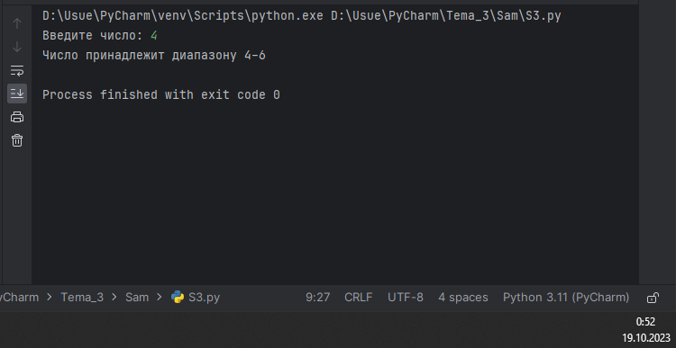

## Выводы

В данном коде выводятся одна строка с использованием функции `print()`. Строка содержит значения:

1. `print(check_range(number))`: Выводится выведенный диапазон. 
  
## Самостоятельная работа №4
### Манипулирование строками. Напишите программу на Python, которая принимает предложение (на английском) в качестве входных данных от пользователя. Выполните следующие операции и отобразите результаты:
•	Выведите длину предложения.
•	Переведите предложение в нижний регистр.
•	Подсчитайте количество гласных (a, e, i, o, u) в предложении.
•	Замените все слова "ugly" на "beauty".
•	Проверьте, начинается ли предложение с "The" и заканчивается ли на "end".
Проверьте работу программы минимум на 3 предложениях, чтобы охватить проверку всех поставленных условий.

```python
predloj = input("Введите предложение: ")
dlina = len(predloj)
lowwer = predloj.lower()

def main():
    masss = lowwer.count('a') + lowwer.count('e') + lowwer.count('i') + lowwer.count('o') + lowwer.count('u')
    skip = lowwer.replace('ugly', 'beauty')
    TheEnd = (lowwer[0] == 't' and lowwer[-1] == 'e')

print("Результаты")
print("↓↓↓↓↓↓↓↓↓↓")
print(f"Длина предложения:  {dlina}")
print(f"Предложение в нижнем регистре:  {lowwer}")
```
### Результат.
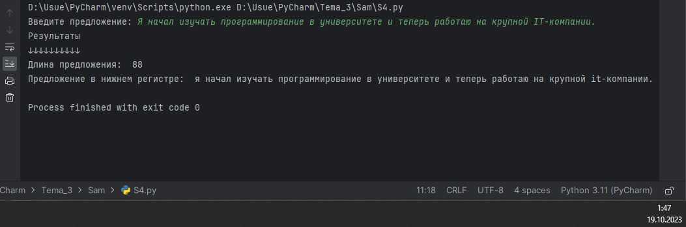


## Выводы

В данном коде выводятся две строки с использованием функции `print()`. Каждая строка содержит разные значения:

1. `print(f"Длина предложения:  {dlina}")`: Выводится количество символов.
2. `print(f"Предложение в нижнем регистре: {lowwer}")`: Выводится перевод предложения в нижний регистр.
  
## Самостоятельная работа №5
### Программу нужно составить из данных фрагментов кода.

```python
string = 'hello'
values = [0, 2, 4, 6, 8, 10]
counter = 0
while ' world' not in string:
    memory = string
    if counter in values:
        string = string + ' world'
    print(string)
    if counter < 10:
        string = memory
    counter += 1
```
### Результат.
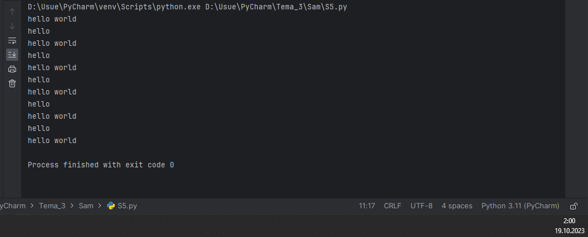
  
## Выводы

В данном коде выводятся одной строки с использованием функции `print()`. Каждая строка содержит разные значения:

1. `print(string)`: Выводится результат цикла. 

## Общие выводы по теме
Операторы которые использовались в этой лабораторной и самостоятельной работы это: Оператор if позволяет выполнить инструкции в зависимости от условия. Конструкция if - else предусматривает альтернативный вариант выполнения программы при ложном условии. Оператор while выполняет инструкции до тех пор, пока условие цикла истинно. Операторы break и continue используются для досрочного прерывания работы цикла и запуска его заново. Оператор for выполняет инструкции заданное количество раз, определяемое количеством элементов в наборе.
