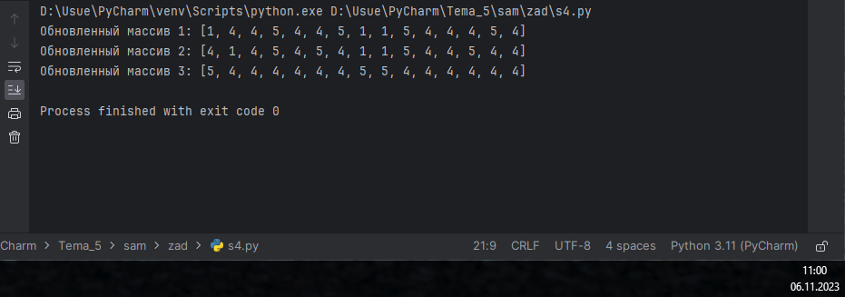

# Тема 6. Базовые коллекции: словари, кортежи
Отчет по Теме #6 выполнил(а):
- Артюшин Вадим Борисович
- ОЗИВТ(ППК)-22-2-у

| Задание | Лаб_раб | Сам_раб |
| ------ | ------ | ------ |
| Задание 1 | + | + |
| Задание 2 | + | + |
| Задание 3 | + | + |
| Задание 4 | + | + |
| Задание 5 | + | + |
| Задание 6 | - | - |
| Задание 7 | - | - |
| Задание 8 | - | - |
| Задание 9 | - | - |
| Задание 10 | - | - |

знак "+" - задание выполнено; знак "-" - задание не выполнено;

Работу проверили:
- к.э.н., доцент Панов М.А.

## Лабораторная работа №1
###  В школе, где вы учились, узнали, что вы крутой программист и попросили написать программу для учителей, которая будет при вводе кабинета писать для него ключ доступа и статус, занят кабинет или нет. При написании программы необходимо использовать словарь (dict), который на вход получает номер кабинета, а выводит необходимую информацию. Если кабинета, который вы ввели нет в словаре, то в консоль в виде значения ключа нужно вывести "None" и виде статуса вывести "False". По большому счету написав данную программу мы с вами научились заменять иногда громоздкую конструкцию if/elif/else. Поскольку здесь функционал словаря полностью повторяет функционал условия, но при этому использования словарей в более сложных программах есть намного больше возможностей реализации.   

```python
request = int(input('Введите номер кабинета: '))

dictionary = {
    101: {'key': 1234, 'access': True},
    102: {'key': 1337, 'access': True},
    103: {'key': 8943, 'access': True},
    104: {'key': 5555, 'access': True},
    None: {'key': None, 'access': False},
}

response = dictionary.get(request)
if not response:
    response = dictionary[None]
key = response.get('key')
access = response.get('access')
print(key, access)
```
### Результат.


## Выводы

В данном коде выводятся одна строка с использованием функции `print()`. Каждая строка содержит разные значения:

1. `print('1', set_1 - set_2)`: Выводится множества.
2. `print('2', set_1 - set_2)`: Выводится множества.
3. `print('3', set_1 - set_2)`: Выводится множества.

## Лабораторная работа №2
### Напишите две одинаковые программы, только одна будет использовать set(), а вторая frozenset() и попробуйте к исходному множеству добавить несколько элементов, например, через цикл.

```python
from pprint import pprint

my_dict = {'first': 'so easy'}

def dict_maker(**kwargs):
    my_dict.update(**kwargs)

dict_maker(a1=1, a2=20, a3=54, a4=13)
dict_maker(name='Вадим', age=22, weight=92, eyes_color='green')
pprint(my_dict)
```
### Результат.
![Меню]lab/pics/2.png)

## Выводы

В данном коде выводятся три строки с использованием функции `print()`. Каждая строка содержит разные значения:

1. `print(a)`: Выводится множества. 
2. `print(a)`: Выводится множества.

## Лабораторная работа №3
### Напишите программу, в которой будет проверяться есть ли переменная в указанном массиве используя логический оператор in. Самостоятельно посмотрите, как работает программа со значениями которых нет в массиве numbers.

```python
input_string = 'HelloWorld'
result = tuple(input_string)
print(result)
print(list(result))
```
### Результат.


## Выводы

В данном коде выводятся одна строка с использованием функции `print()`. Каждая строка содержит разные значения:

1. `print(replace([1, 2, 3, 4, 5]))`: Выводится список наоброт. 


## Лабораторная работа №4
### Напишите программу, которая будет определять находится ли переменная в указанном массиве и если да, то проверьте четная она или нет. Самостоятельно протестируйте данную программу с разными значениями переменной value.

```python
def personal_info(name, age, company='unnamed'):
    print(f"Имя: {name} Возраст: {age} Компания: {company}")

tom = ("Григорий", 22)
personal_info(*tom)

bob = ("Григорий", 41, "Yandex")
personal_info(*bob)
```
### Результат.


## Выводы

В данном коде выводятся одна строка с использованием функции `print()`. Каждая строка содержит разные значения:

1. `print(a[2:6])`: Выводится список.


## Лабораторная работа №5
### Напишите программу, в которой циклом for значения переменной i будут меняться от 0 до 10 и посмотрите, как разные виды сравнений и операций работают в цикле.

```python
def tuple_sort(tpl):
    for elm in tpl:
        if not isinstance(elm, int):
            return tpl
    return tuple(sorted(tpl))

if __name__ == '__main__':
    print(tuple_sort((5, 5, 3, 1, 9)))
    print(tuple_sort((5, 5, 2.1, '1', 9)))
```
### Результат.


## Выводы

В данном коде выводятся три строки с использованием функции `print()`. Каждая строка содержит разные значения:

1. `print(useless([3, 5, 7, 3, 33]))`: Выводится значение. 
2. `print(useless([-12.5, 54, 77.3, 0, -36, 98.2, -63, 21.7, 47, -89.6]))`: Выводится значение.
3. `print(useless([-25.8, 86, 12.5, -56, 73.2, 0, 43, -91.5, 65.9, -7]))`: Выводится значение.

## Самостоятельная работа №1
### Ресторан на предприятии ведет учет посещений за неделю при помощи кода работника. У них есть список со всеми посещениями за неделю.
Ваша задача почитать:
- Сколько было выдано чеков
- Сколько разных людей посетило ресторан
- Какой работник посетил ресторан больше всех раз.
Список выданных чеков за неделю:
[8734, 2345, 8201, 6621, 9999, 1234, 5678, 8201, 8888, 4321, 3365,
1478, 9865, 5555, 7777, 9998, 1111, 2222, 3333, 4444, 5556, 6666,
5410, 7778, 8889, 4445, 1439, 9604, 8201, 3365, 7502, 3016, 4928,
5837, 8201, 2643, 5017, 9682, 8530, 3250, 7193, 9051, 4506, 1987,
3365, 5410, 7168, 7777, 9865, 5678, 8201, 4445, 3016, 4506, 4506]
Результатом выполнения задачи будет: листинг кода, и вывод в консоль, в котором будет указана вся необходимая информация.

```python
user_input = input("Введите числа через пробел: ")
numbers_list = user_input.split()  # преобразуем строку в список
numbers_tuple = tuple(numbers_list)  # преобразуем список в кортеж

print(f"Список: {numbers_list}")
print(f"Кортеж: {numbers_tuple}")
```
### Результат.


## Выводы

В данном коде выводятся две строки с использованием функции `print()`. Каждая строка содержит разные значения:

1. `print("Выдано чеков:", len(counts))`: Выводится сколько выдано чеков.
2. `print("Разных людей:", len(counts.keys()))`: Выводится сколько разных людей.

## Самостоятельная работа №2
### На физкультуре студенты сдавали бег, у преподавателя физкультуры есть список всех результатов, ему нужно узнать
- Три лучшие результата
- Три худшие результаты
- Все результаты начиная с 10
Ваша задача помочь ему в этом.
Список результатов бега:
[10.2, 14.8, 19.3, 22.7, 12.5, 33.1, 38.9, 21.6, 26.4, 17.1, 30.2, 35.7, 16.9, 27.8, 24.5, 16.3, 18.7, 31.9, 12.9, 37.4]
Результатом выполнения задачи будет: листинг кода, и вывод в консоль, в котором будет указана вся необходимая информация.

```python
def remove_first_occurrence(tuple, element):
    try:
        tuple = tuple[:tuple.index(element)] + tuple[tuple.index(element) + 1:]
    except ValueError:
        pass
    return tuple


test_cases = [
    ((1, 2, 3), 1),
    ((1, 2, 3, 1, 2, 3, 4, 5, 2, 3, 4, 2, 4, 2), 3),
    ((2, 4, 6, 6, 4, 2), 9),
]

for tuple, element in test_cases:
    modified_tuple = remove_first_occurrence(tuple, element)
    print(f"{tuple=}, modified: {modified_tuple}")
```
### Результат.


## Выводы

В данном коде выводятся три строки с использованием функции `print()`. Каждая строка содержит разные значения:

1. `print("Три лучшие результаты:", bestThree)`: Выводится три лучшие результаты.
2. `print("Три худшие результаты:", worstThree)`: Выводится три худшие результаты.
3. `print("Все результаты от 10:", results10AndAbove)`: Выводится все результаты от 10.
  
## Самостоятельная работа №3
### Преподаватель по математике придумал странную задачу. У вас есть три списка с элементами, каждый элемент которых - длина стороны треугольника, ваша задача найти площади двух треугольников, составленные из максимальных и минимальных элементов полученных списков. Результатом выполнения задачи будет: листинг кода, и вывод в консоль, в котором будут указаны два этих значения.
Три списка:
one = [12, 25, 3, 48, 71]
two = [5, 18, 40, 62, 98]
three = [4, 21, 37, 56, 84]

```python
def most_frequent_digits(numbers_string):
  digits_count = {}
  for digit in numbers_string:
    if digit in '0123456789':
      if digit in digits_count:
        digits_count[digit] += 1
      else:
        digits_count[digit] = 1
  sorted_count = {k: v for k, v in sorted(digits_count.items(), key = lambda x: x)}
  return sorted_count

# Test the function
input_number_string = '123321'
print(most_frequent_digits(input_number_string))
```
### Результат.


## Выводы

В данном коде выводятся одна строка с использованием функции `print()`. Строка содержит значения:

1. `print(f"Максимальная площадь: {max_area}\nМинимальная площадь: {min_area}")`: Выводится максимальная и минимальная площадь. 
  
## Самостоятельная работа №4
### Никто не любит получать плохие оценки, поэтому Борис решил это
исправить. Допустим, что все оценки студента за семестр хранятся в
одном списке. Ваша задача удалить из этого списка все двойки, а все
тройки заменить на четверки.
Списки оценок (проверить работу программы на всех трех вариантах):
[2, 3, 4, 5, 3, 4, 5, 2, 2, 5, 3, 4, 3, 5, 4]
[4, 2, 3, 5, 3, 5, 4, 2, 2, 5, 4, 3, 5, 3, 4]
[5, 4, 3, 3, 4, 3, 3, 5, 5, 3, 3, 3, 3, 4, 4]
Результатом выполнения задачи будет: листинг кода, и вывод в
консоль, в котором будут три обновленных массива.

```python
def entry_exit_seq(employee_id, seq):
	employee_found = False
	output = []
	for item in seq:
		if item == employee_id and not employee_found:
			employee_found = True
		elif item == employee_id and employee_found:
			break
		else:
			output.append(item)
	return output
print(entry_exit_seq(8, (1,2,3))) # [8]
print(entry_exit_seq(8, (1,8,3,4,8,8,9,2))) # [8,8,8]
print(entry_exit_seq(8, (1,2,8,5,1,2,9))) # [8,1,2]
```
### Результат.


## Выводы

В данном коде выводятся две строки с использованием функции `print()`. Каждая строка содержит разные значения:

1. `print("Обновленный массив 1:", updated_grades_1)`: Выводится Обновленный массив 1.
2. `print("Обновленный массив 2:", updated_grades_1)`: Выводится Обновленный массив 2.
3. `print("Обновленный массив 3:", updated_grades_1)`: Выводится Обновленный массив 3.

  
## Самостоятельная работа №5
### Вам предоставлены списки натуральных чисел, из них необходимо сформировать множества. При этом следует соблюдать это правило: если какое-либо число повторяется, то преобразовать его в строку поиска следующему образцу: например, если число 4 повторяется 3 раза, то в множестве будет следующая запись: само число 4, строка «44», строка «444».
Множества для теста:
list_1 = [1, 1, 3, 3, 1]
лист_2 = [5, 5, 5, 5, 5, 5, 5]
list_3 = [2, 2, 1, 2, 2, 5, 6, 7, 1, 3, 2, 2]
Результаты вывода (порядок может отличаться, поскольку мы работаем
c set()):
{11', 1, 3, '33',"111}
{5, '5555', '555555', '555555', '555', '55', '55555555'}
{11', 1, 3, 2, 5, 6, '222222', '222', 7, '2222', '22222', '22},

```python
def max_element(numbers):
    return max(numbers)

tests = [
    ([2, 3, 4], 4),
    ([5, 6], 6),
    ([7, 8, 9], 9),
]

for numbers, expected_max in tests:
    actual_max = max_element(numbers)
    print(f"Для списка {numbers} максимальный элемент равен {actual_max}, что совпадает с ожидаемым значением {expected_max}")
```
### Результат.

  
## Выводы

В данном коде выводятся три строки с использованием функции `print()`. Каждая строка содержит разные значения:

1. `print(create_set(list_1))`: Выводится множества.
2. `print(create_set(list_2))`: Выводится множества.
3. `print(create_set(list_3))`: Выводится множества.

## Общие выводы по теме
Множества и списки являются основными структурами данных в Python. Множество - это неупорядоченный набор уникальных элементов. Для создания множества используется фигурные скобки, например {1,2,‘a’}. В одном множестве не может быть повторяющихся элементов. Список - это упорядоченная коллекция элементов одного типа, которые разделяются запятыми. Для создания списка используются квадратные скобки, например [1,2,‘a’]. В списке могут быть повторяющиеся элементы.
