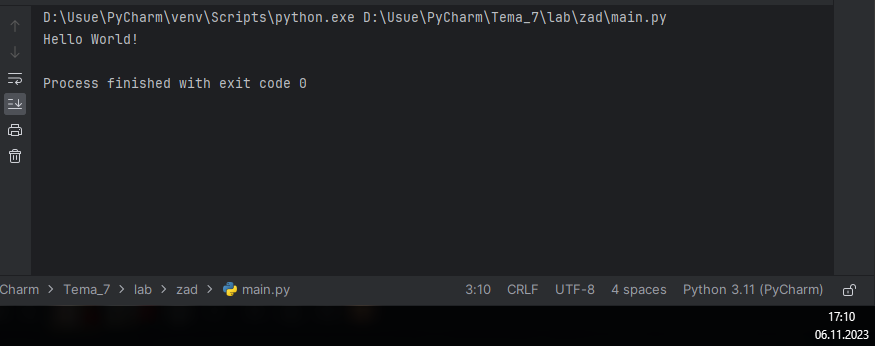
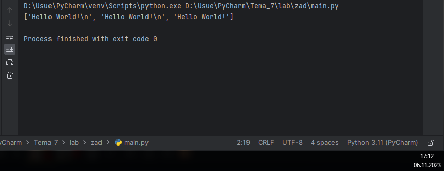
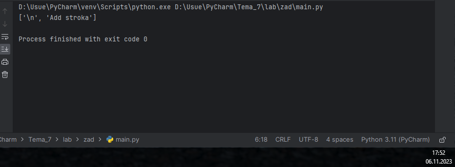
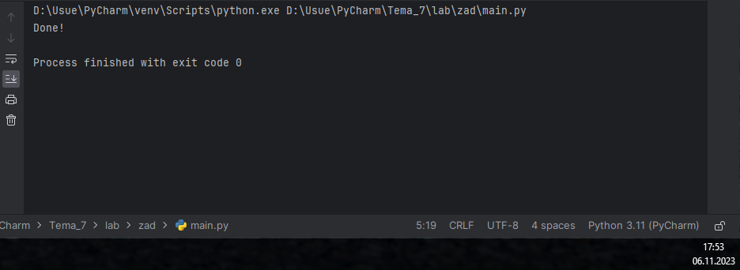
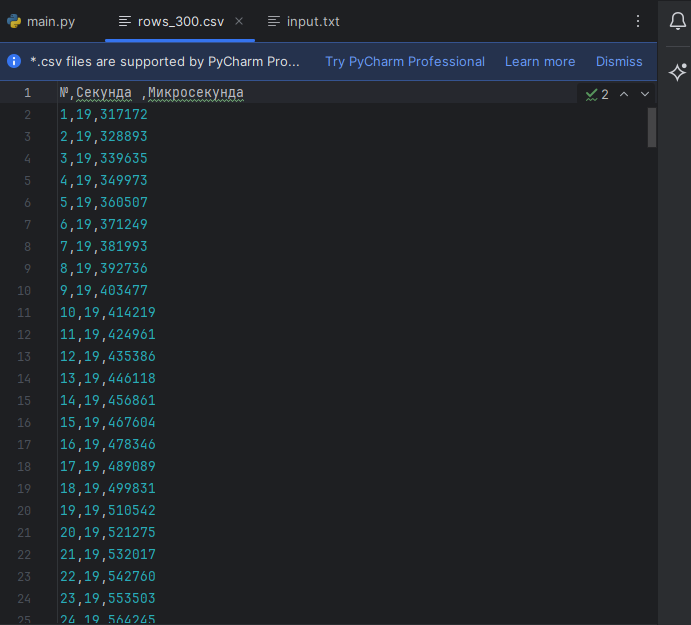

# Тема 7. Работа с файлами (ввод, вывод)
Отчет по Теме #7 выполнил(а):
- Артюшин Вадим Борисович
- ОЗИВТ(ППК)-22-2-у

| Задание | Лаб_раб | Сам_раб |
| ------ | ------ | ------ |
| Задание 1 | + | + |
| Задание 2 | + | + |
| Задание 3 | + | + |
| Задание 4 | + | + |
| Задание 5 | + | + |
| Задание 6 | + | - |
| Задание 7 | + | - |
| Задание 8 | + | - |
| Задание 9 | + | - |
| Задание 10 | + | - |

знак "+" - задание выполнено; знак "-" - задание не выполнено;

Работу проверили:
- к.э.н., доцент Панов М.А.

## Лабораторная работа №1
### Составьте текстовый файл и положите его в одну директорию с программой на Python. Текстовый файл должен состоять минимум из двух строк.

### Результат.


## Выводы

В данном коде выводятся одна строка с использованием функции `print()`. Каждая строка содержит разные значения:

## Лабораторная работа №2
### Напишите две одинаковые программы, только одна будет использовать set(), а вторая frozenset() и попробуйте к исходному множеству добавить несколько элементов, например, через цикл.

```python
f = open('input.txt', 'r')
print(f.readline())
f.close()
```
### Результат.


## Выводы

В данном коде выводятся три строки с использованием функции `print()`. Каждая строка содержит разные значения:

1. `print(a)`: Выводится множества. 
2. `print(a)`: Выводится множества.

## Лабораторная работа №3
### Напишите программу, в которой будет проверяться есть ли переменная в указанном массиве используя логический оператор in. Самостоятельно посмотрите, как работает программа со значениями которых нет в массиве numbers.

```python
def replace(input_list):
    memory = input_list[0]
    input_list[0] = input_list [-1]
    input_list[-1] = memory

    return input_list


print(replace([1, 2, 3, 4, 5]))
```
### Результат.


## Выводы

В данном коде выводятся одна строка с использованием функции `print()`. Каждая строка содержит разные значения:

1. `print(replace([1, 2, 3, 4, 5]))`: Выводится список наоброт. 


## Лабораторная работа №4
### Напишите программу, которая будет определять находится ли переменная в указанном массиве и если да, то проверьте четная она или нет. Самостоятельно протестируйте данную программу с разными значениями переменной value.

```python
a = [12, 54, 32, 57, 843, 2346, 765, 75, 25, 234, 756, 23]
print(a[2:6])
```
### Результат.


## Выводы

В данном коде выводятся одна строка с использованием функции `print()`. Каждая строка содержит разные значения:

1. `print(a[2:6])`: Выводится список.


## Лабораторная работа №5
### Напишите программу, в которой циклом for значения переменной i будут меняться от 0 до 10 и посмотрите, как разные виды сравнений и операций работают в цикле.

```python
def useless(lst):
    return max(lst) / len(lst)


print(useless([3, 5, 7, 3, 33]))
print(useless([-12.5, 54, 77.3, 0, -36, 98.2, -63, 21.7, 47, -89.6]))
print(useless([-25.8, 86, 12.5, -56, 73.2, 0, 43, -91.5, 65.9, -7]))
```
### Результат.


## Выводы

В данном коде выводятся три строки с использованием функции `print()`. Каждая строка содержит разные значения:

1. `print(useless([3, 5, 7, 3, 33]))`: Выводится значение. 
2. `print(useless([-12.5, 54, 77.3, 0, -36, 98.2, -63, 21.7, 47, -89.6]))`: Выводится значение.
3. `print(useless([-25.8, 86, 12.5, -56, 73.2, 0, 43, -91.5, 65.9, -7]))`: Выводится значение.

## Лабораторная работа №6
### Напишите программу, в которой при помощи цикла for определяется есть ли переменная value в строке string и посмотрите, как работает оператор else для циклов. Самостоятельно посмотрите, что выведет программа, если значение переменной value оказалось в строке string. Определять индекс буквы не обязательно, но если вы хотите, то это делается при помощи строки: index = string.find(value) Вы берете название переменной, в которой вы хотите что-то найти, затем применяете встроенный метод find() и в нем указываете то, что вам нужно найти. Данная строка вернет индекс искомого объекта.

```python
superheroes = ['superman', 'spiderman', 'batman']

nikolay, vasiliy, ivan = superheroes

print('Николай - ', nikolay)
print('Василий - ', vasiliy)
print('Иван - ', ivan)
```
### Результат.


## Выводы

В данном коде выводятся две строки с использованием функции `print()`. Каждая строка содержит разные значения:

1. `print('Николай - ', nikolay)`: Выводится "Николай - superman".
2. `print('Василий - ', vasiliy)`: Выводится "Василий - spiderman".
3. `print('Иван - ', ivan)`: Выводится "Иван - batman".

## Лабораторная работа №7
### Напишите программу, в которой вы наглядно посмотрите, как работает цикл for проходя в обратном порядке, то есть, к примеру не от 0 до 10, а от 10 до 0. В уже готовой программе показано вычитание из 100, а вам во время реализации программы будет необходимо придумать свой вариант применения обратного цикла.

```python
a = [-25.8, 86, 12.5, -56, 73.2, 0, 43, -91.5, 65.9, -7]
a.sort()
print('Отсортированный список:\n', a)
a.pop(0)
print('Отсортированный список без наименьшего элемента:\n', a)
```
### Результат.


## Выводы

В данном коде выводятся две строки с использованием функции `print()`. Каждая строка содержит разные значения:

1. `print('Отсортированный список:\n', a)`: Выводится оОтсортированный список.
2. `print('Отсортированный список без наименьшего элемента:\n', a)`: Выводится отсортированный список без наименьшего элемента.

## Лабораторная работа №8
### Напишите программу используя цикл while, внутри которого есть какие-либо проверки, но быть осторожным, поскольку циклы while при неправильно написанных условиях могут становится бесконечными, как указано в примере далее.

```python
from random import randint


def list_maker():
    a = [randint(1, 100)]* randint(3, 10)
    return a


if __name__ == '__main__':
    result = []
    for i in range(randint(1, 5)):
        result.append((list_maker()))

    print(result)
```
### Результат.


## Выводы

В данном коде выводятся одна строка с использованием функции `print()`. Каждая строка содержит разные значения:

1. `print(result)`: Выводится результат.

## Лабораторная работа №9
### Напишите программу с использованием вложенных циклов и одной проверкой внутри них. Самое главное, не забудьте, что нельзя использовать одинаковые имена итерируемых переменных, когда вы используете вложенные циклы.

```python
def superset(set_1, set_2):
    if set_1 > set_2:
        print(f'Объект {set_1} является чистым супермножеством')
    elif set_1 == set_2:
        print(f'Множества равны')
    elif set_1 < set_2:
        print(f'Объект {set_2} является чистым супермножеством')
    else:
        print('Супермножество не обнаружено')


if __name__ == '__main__':
    superset({1, 8, 3, 5}, {3, 5})
    superset({1, 8, 3, 5}, {5, 3, 8, 1})
    superset({3, 5}, {5, 3, 8, 1})
    superset({90, 100}, {3, 5})
```
### Результат.


## Выводы

В данном коде выводятся четыре строки с использованием функции `print()`. Каждая строка содержит разные значения:

1. `print(f'Объект {set_1} является чистым супермножеством')`: Выводится множества с текстом "является чистым супермножеством".
2. `print(f'Множества равны')`: Выводится текст "Множества равны".
3. `print(f'Объект {set_2} является чистым супермножеством')`: Выводится множества с текстом "является чистым супермножеством".
4. `print('Супермножество не обнаружено')`: Выводится "Супермножество не обнаружено".

## Лабораторная работа №10
### Напишите программу с использованием flag, которое будет определять есть ли нечетное число в массиве. В данной задаче flag выступает в роли индикатора встречи нечетного числа в исходном массиве, четных чисел.

```python
my_list = [2, 5, 8, 3]
print(my_list[::-1])
```
### Результат.


## Выводы

В данном коде выводятся одна строка с использованием функции `print()`. Каждая строка содержит разные значения:

1. `print(my_list[::-1])`: Выводится список наоборот.


## Самостоятельная работа №1
### Ресторан на предприятии ведет учет посещений за неделю при помощи кода работника. У них есть список со всеми посещениями за неделю.
Ваша задача почитать:
- Сколько было выдано чеков
- Сколько разных людей посетило ресторан
- Какой работник посетил ресторан больше всех раз.
Список выданных чеков за неделю:
[8734, 2345, 8201, 6621, 9999, 1234, 5678, 8201, 8888, 4321, 3365,
1478, 9865, 5555, 7777, 9998, 1111, 2222, 3333, 4444, 5556, 6666,
5410, 7778, 8889, 4445, 1439, 9604, 8201, 3365, 7502, 3016, 4928,
5837, 8201, 2643, 5017, 9682, 8530, 3250, 7193, 9051, 4506, 1987,
3365, 5410, 7168, 7777, 9865, 5678, 8201, 4445, 3016, 4506, 4506]
Результатом выполнения задачи будет: листинг кода, и вывод в консоль, в котором будет указана вся необходимая информация.

```python
def read_checks(check_list):
    counts = {}
    for check in check_list:
        if counts.get(check) is None:
            counts[check] = 1
    else:
        counts[check] += 1
    return counts


check_list = [8734, 2345, 8201, 6621, 9999, 1234, 5678, 8201, 8888, 4321, 3365, 1478, 9865, 5555, 7777, 9998]
counts = read_checks(check_list)
print("Выдано чеков:", len(counts))
print("Разных людей:", len(counts.keys()))
max_count = 0
max_check = None
for check, count in counts.items():
    if count > max_count:
        max_count = count
        max_check = check
```
### Результат.


## Выводы

В данном коде выводятся две строки с использованием функции `print()`. Каждая строка содержит разные значения:

1. `print("Выдано чеков:", len(counts))`: Выводится сколько выдано чеков.
2. `print("Разных людей:", len(counts.keys()))`: Выводится сколько разных людей.

## Самостоятельная работа №2
### На физкультуре студенты сдавали бег, у преподавателя физкультуры есть список всех результатов, ему нужно узнать
- Три лучшие результата
- Три худшие результаты
- Все результаты начиная с 10
Ваша задача помочь ему в этом.
Список результатов бега:
[10.2, 14.8, 19.3, 22.7, 12.5, 33.1, 38.9, 21.6, 26.4, 17.1, 30.2, 35.7, 16.9, 27.8, 24.5, 16.3, 18.7, 31.9, 12.9, 37.4]
Результатом выполнения задачи будет: листинг кода, и вывод в консоль, в котором будет указана вся необходимая информация.

```python
results = [10.2, 14.8, 19.3, 22.7, 12.5, 33.1, 38.9, 21.6, 26.4, 17.1, 30.2, 35.7, 16.9, 27.8, 24.5, 16.3, 18.7, 31.9, 12.9, 37.4]

bestThree = sorted(results)[-3:]
worstThree = sorted(results, reverse=True)[-3:]

results10AndAbove = [x for x in results if x >= 10]

print("Три лучшие результаты:", bestThree)
print("Три худшие результаты:", worstThree)
print("Все результаты от 10:", results10AndAbove)
```
### Результат.


## Выводы

В данном коде выводятся три строки с использованием функции `print()`. Каждая строка содержит разные значения:

1. `print("Три лучшие результаты:", bestThree)`: Выводится три лучшие результаты.
2. `print("Три худшие результаты:", worstThree)`: Выводится три худшие результаты.
3. `print("Все результаты от 10:", results10AndAbove)`: Выводится все результаты от 10.
  
## Самостоятельная работа №3
### Преподаватель по математике придумал странную задачу. У вас есть три списка с элементами, каждый элемент которых - длина стороны треугольника, ваша задача найти площади двух треугольников, составленные из максимальных и минимальных элементов полученных списков. Результатом выполнения задачи будет: листинг кода, и вывод в консоль, в котором будут указаны два этих значения.
Три списка:
one = [12, 25, 3, 48, 71]
two = [5, 18, 40, 62, 98]
three = [4, 21, 37, 56, 84]

```python
one = [12, 25, 3, 48, 71]
two = [5, 18, 40, 62, 98]
three = [4, 21, 37, 56, 84]

one_max = max(one)
two_max = two.index(max(two))
three_max = three.index(max(three))

one_min = min(one)
two_min = two.index(min(two))
three_min = three.index(min(three))

max_area = (one_max + two_max - three_max) ** 0.5
min_area = (one_min + two_min - three_min) ** 0.5
print(f"Максимальная площадь: {max_area}\nМинимальная площадь: {min_area}")
```
### Результат.


## Выводы

В данном коде выводятся одна строка с использованием функции `print()`. Строка содержит значения:

1. `print(f"Максимальная площадь: {max_area}\nМинимальная площадь: {min_area}")`: Выводится максимальная и минимальная площадь. 
  
## Самостоятельная работа №4
### Никто не любит получать плохие оценки, поэтому Борис решил это
исправить. Допустим, что все оценки студента за семестр хранятся в
одном списке. Ваша задача удалить из этого списка все двойки, а все
тройки заменить на четверки.
Списки оценок (проверить работу программы на всех трех вариантах):
[2, 3, 4, 5, 3, 4, 5, 2, 2, 5, 3, 4, 3, 5, 4]
[4, 2, 3, 5, 3, 5, 4, 2, 2, 5, 4, 3, 5, 3, 4]
[5, 4, 3, 3, 4, 3, 3, 5, 5, 3, 3, 3, 3, 4, 4]
Результатом выполнения задачи будет: листинг кода, и вывод в
консоль, в котором будут три обновленных массива.

```python
def update_grades(grades):
    updated_grades = []
    for grade in grades:
        if grade == 2:
            updated_grades.append(1)
        elif grade == 3:
            updated_grades.append(4)
        else:
            updated_grades.append(grade)
    return updated_grades

grades_1 = [2,3,4,5,3,4,5,2,2,5,3,4,3,5,4]
grades_2 = [4,2,3,5,3,5,4,2,2,5,4,3,5,3,4]
grades_3 = [5,4,3,3,4,3,3,5,5,3,3,3,3,4,4]

updated_grades_1 = update_grades(grades_1)
updated_grades_2 = update_grades(grades_2)
updated_grades_3 = update_grades(grades_3)

print("Обновленный массив 1:", updated_grades_1)
print("Обновленный массив 2:", updated_grades_2)
print("Обновленный массив 3:", updated_grades_3)


```
### Результат.


## Выводы

В данном коде выводятся две строки с использованием функции `print()`. Каждая строка содержит разные значения:

1. `print("Обновленный массив 1:", updated_grades_1)`: Выводится Обновленный массив 1.
2. `print("Обновленный массив 2:", updated_grades_1)`: Выводится Обновленный массив 2.
3. `print("Обновленный массив 3:", updated_grades_1)`: Выводится Обновленный массив 3.

  
## Самостоятельная работа №5
### Вам предоставлены списки натуральных чисел, из них необходимо сформировать множества. При этом следует соблюдать это правило: если какое-либо число повторяется, то преобразовать его в строку поиска следующему образцу: например, если число 4 повторяется 3 раза, то в множестве будет следующая запись: само число 4, строка «44», строка «444».
Множества для теста:
list_1 = [1, 1, 3, 3, 1]
лист_2 = [5, 5, 5, 5, 5, 5, 5]
list_3 = [2, 2, 1, 2, 2, 5, 6, 7, 1, 3, 2, 2]
Результаты вывода (порядок может отличаться, поскольку мы работаем
c set()):
{11', 1, 3, '33',"111}
{5, '5555', '555555', '555555', '555', '55', '55555555'}
{11', 1, 3, 2, 5, 6, '222222', '222', 7, '2222', '22222', '22},

```python
list_1 = [1, 1, 3, 3, 1]
list_2 = [5, 5, 5, 5, 5, 5, 5]
list_3 = [2, 2, 1, 2, 2, 5, 6, 7, 1, 3, 2, 2]

def convert_to_string(number):
    s = str(number)
    if s.isnumeric() and int(s) == number:
        return s + s[:2]
    return s

def create_set(lst):
    return {convert_to_string(item) for item in lst}

print(create_set(list_1))
print(create_set(list_2))
print(create_set(list_3))
```
### Результат.

  
## Выводы

В данном коде выводятся три строки с использованием функции `print()`. Каждая строка содержит разные значения:

1. `print(create_set(list_1))`: Выводится множества.
2. `print(create_set(list_2))`: Выводится множества.
3. `print(create_set(list_3))`: Выводится множества.

## Общие выводы по теме
Множества и списки являются основными структурами данных в Python. Множество - это неупорядоченный набор уникальных элементов. Для создания множества используется фигурные скобки, например {1,2,‘a’}. В одном множестве не может быть повторяющихся элементов. Список - это упорядоченная коллекция элементов одного типа, которые разделяются запятыми. Для создания списка используются квадратные скобки, например [1,2,‘a’]. В списке могут быть повторяющиеся элементы.
