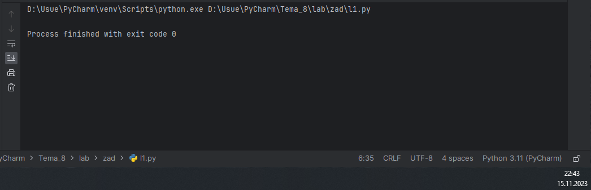
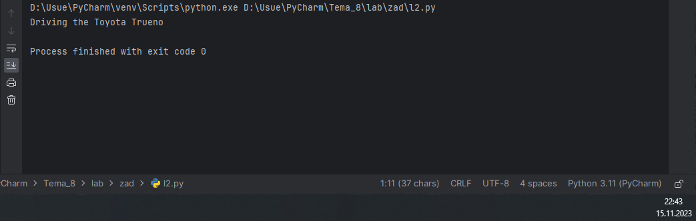
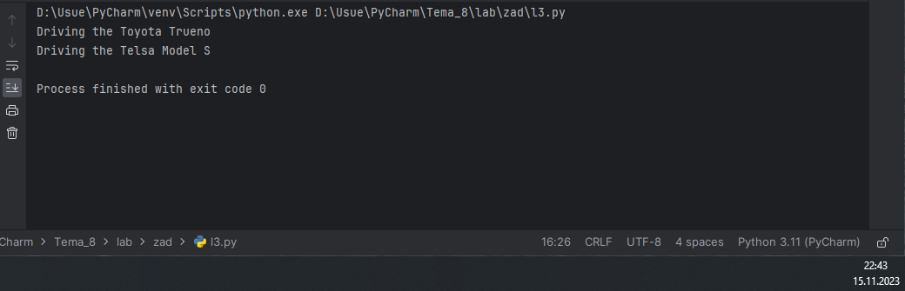
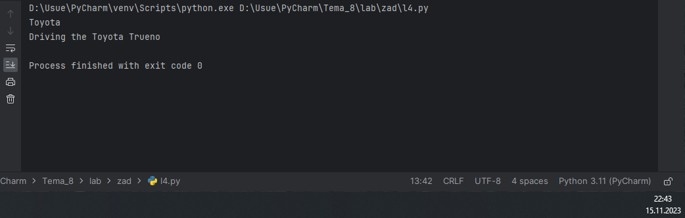
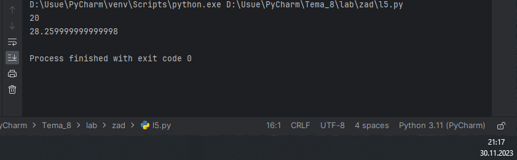
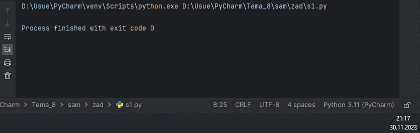
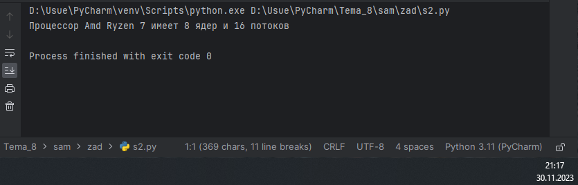
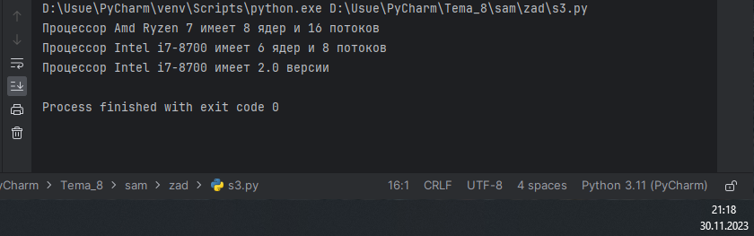
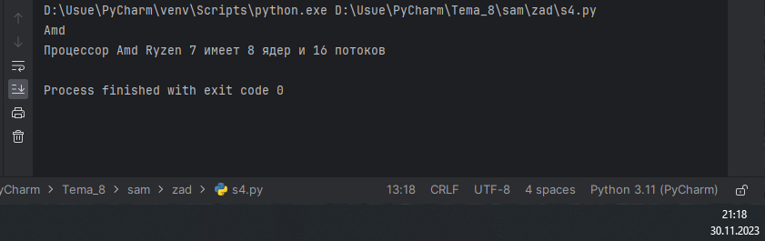
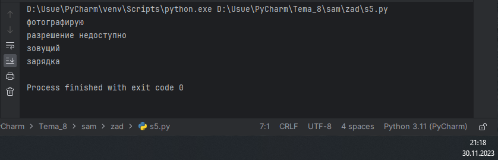

# Тема 8. Работа с файлами (ввод, вывод)
Отчет по Теме #8 выполнил(а):
- Артюшин Вадим Борисович
- ОЗИВТ(ППК)-22-2-у

| Задание | Лаб_раб | Сам_раб |
| ------ | ------ | ------ |
| Задание 1 | + | + |
| Задание 2 | + | + |
| Задание 3 | + | + |
| Задание 4 | + | + |
| Задание 5 | + | + |
| Задание 6 | - | - |
| Задание 7 | - | - |
| Задание 8 | - | - |
| Задание 9 | - | - |
| Задание 10 | - | - |

знак "+" - задание выполнено; знак "-" - задание не выполнено;

Работу проверили:
- к.э.н., доцент Панов М.А.

## Лабораторная работа №1
### Создайте класс “Car” с атрибутами производитель и модель. Создайте объект этого класса. Напишите комментарии для кода, объясняющие его работу. Результатом выполнения задания будет листинг кода с комментариями.

```python
class Car: #Класс для представления автомобиля.
    def __init__(self, make, model): #Метод инициализации с параметрами: марка и модель автомобиля.
        self.make = make    #Свойство класса для хранения марки автомобиля.
        self.model = model  #Свойство класса для хранения модели автомобиля.

my_car = Car("Toyota", "Trueno") #Создаем экземпляр класса Car с маркой Toyota и моделью Trueno.
```

### Результат.


## Выводы

Была создана папка и текстовый файл.

## Лабораторная работа №2
### Напишите программу, которая выведет только первую строку из вашего файла, при этом используйте конструкцию open()/close().

```python
class Car: # Класс для представления автомобиля
    def __init__(self, make, model): # Метод инициализации автомобиля с параметрами: марка и модель
        self.make = make # Свойство класса для хранения марки
        self.model = model # Свойство класса для хранения модели

    def drive(self): # Метод для управления автомобилем
        print(f"Driving the {self.make} {self.model}") # Вывод информации о марке и модели

my_car = Car("Toyota", "Trueno") # Создание экземпляра класса Car с определенными параметрами
my_car.drive() # Управление созданным экземпляром
```
### Результат.


## Выводы

В данном коде выводятся одна строка с использованием функции `print()`. Каждая строка содержит разные значения:

1. `print(f.readline())`: Выводится первая строка. 

## Лабораторная работа №3
### Напишите программу, которая выведет все строки из вашего файла в массиве, при этом используйте конструкцию open()/close().

```python
class Car: #Он определяет основные характеристики автомобиля, такие как марка и модель. Также он имеет метод drive(), который выводит на экран сообщение о том, что автомобиль едет.
    def __init__(self, make, model): #Это конструктор класса. Он инициализирует атрибуты make и model для каждого экземпляра класса.
        self.make = make #Эта строка устанавливает атрибут make для экземпляра класса.
        self.model = model #Эта строка делает то же самое для атрибута model.
    def drive(self): #Данный метод имитирует процесс вождения автомобиля.
        print(f"Driving the {self.make} {self.model}") #Эта строка выводит информацию о марке и модели автомобиля на экран.
my_car = Car("Toyota", "Trueno") #Здесь создается экземпляр класса Car с маркой Toyota и моделью Trueno.
my_car.drive() #Вызов метода drive() для экземпляра my_car имитирует процесс управления автомобилем.
class ElectricCar(Car): #Этот класс наследует все методы и атрибуты от класса Car и добавляет новые.
    def __init__(self, make, model, battery_capacity): #Конструктор этого класса принимает дополнительные параметры: емкость аккумулятора.
        super().__init__(make, model) #Вызывается конструктор родительского класса для инициализации атрибутов make и model.
        self.battery_capacity = battery_capacity #Атрибут battery_capacity присваивается экземпляру класса.
    def charge(self): #имитирует зарядку аккумулятора.
        print(f"Charging the {self.make} {self.model} with {self.battery_capacity}  kWh") #Вывод информации о процессе зарядки на экран.
my_electric_car = ElectricCar("Telsa", "Model S", 75) #Создание экземпляра класса ElectricCar с маркой Telsa, моделью Model S и емкостью аккумулятора 75 kWh.
my_electric_car.drive() #
```
### Результат.


## Выводы

В данном коде выводятся одна строка с использованием функции `print()`. Каждая строка содержит разные значения:

1. `print(f.readlines())`: Выводится выводит все строки. 


## Лабораторная работа №4
### Напишите программу, которая выведет все строки из вашего файла в массиве, при этом используйте конструкцию with open().
```python
class Car: #Эта строка описывает класс с именем Car. Внутри фигурных скобок содержатся определения методов и переменных, которые принадлежат этому классу.
    def __init__(self, make, model): #Это конструктор класса, который инициализирует его атрибуты. В данном случае он принимает два аргумента: make (марка автомобиля) и model (модель автомобиля).
        self.make = make #Атрибут self.make устанавливается равным аргументу make.
        self.model = model #То же самое происходит с атрибутом model и его аргументом model.

    def drive(self): #Это метод, который “имитирует” вождение автомобиля. Он просто выводит сообщение на экран.
        print(f"Driving the {self.make} {self.model}") #Эта строка выводит на экран информацию о марке и модели автомобиля.

my_car = Car("Toyota", "Trueno") #Здесь создается экземпляр класса Car, который представляет автомобиль марки “Toyota” модели “Trueno”.


print(my_car.make) #Эта строка выводит марку автомобиля, который был создан выше.
my_car.drive() #Вызов метода drive() на Aэкземпляре my_car “имитирует” процесс вождения автомобиля.
```
### Результат.


## Выводы

В данном коде выводятся одна строка с использованием функции `print()`. Каждая строка содержит разные значения:

1. `print(f.readlines())`: Выводится выводит все строки.

## Лабораторная работа №5
### Напишите программу, которая выведет каждую строку из вашего файла отдельно, при этом используйте конструкцию with open().

```python
class Shape: #Определяется класс Shape.
    def area(self): #Определяется метод area в классе Shape. Пока он не имеет реализации и просто использует оператор pass.
        pass #Заканчивается определение класса Shape.
class Rectangle(Shape): #Создаем класс Rectangle, который наследуется от класса Shape
    def __init__(self, width, height): #Определяем конструктор класса, который принимает параметры width и height
        self.width = width #
        self.height = height #Инициализируем атрибуты width и height с помощью переданных значений

    def area(self): #Определяем метод area, который возвращает площадь прямоугольника, вычисленную как произведение ширины и высоты
        return self.width * self.height #

class Circle(Shape): #Определяется класс Circle, который наследуется от класса Shape.
    def __init__(self, radius): #Определяется метод инициализации (__init__) в классе Circle. Он принимает один параметр - radius (радиус).
        self.radius = radius #В методе инициализации класса Circle устанавливается значение атрибута radius на основе переданного параметра.

    def area(self): #Определяется метод area для класса Circle, который переопределяет метод area из класса Shape.
        return 3.14 * self.radius * self.radius #В методе area класса Circle вычисляется и возвращается площадь круга, умножая квадрат радиуса на число Pi (3.14).

shapes = [Rectangle(4, 5), Circle(3)] #Создается список shapes, который содержит два элемента: объекты классов Rectangle и Circle, созданные с определенными параметрами.
for shape in shapes: #Выполняется цикл, который проходит по каждому элементу списка shapes.
    print(shape.area()) #Выводится площадь текущей фигуры (shape) с помощью вызова метода area() для текущего объекта.
```
### Результат.


## Самостоятельная работа №1
### Найдите в интернете любую статью (объем статьи не менее 200 слов), скопируйте ее содержимое в файл и напишите программу, которая считает количество слов в текстовом файле и определит
самое часто встречающееся слово. Результатом выполнения задачи будет: скриншот файла со статьей, листинг кода, и вывод в консоле в котором будет указана вся необходимая информация.

```python
class CPU:
    def __init__(self, Brand, Models, Cores, Threads):
        self.Brand = Brand
        self.Models = Models
        self.Cores = Cores
        self.Threads = Threads

my_CPU = CPU("Amd", "Ryzen 7", "8", "16")
```
### Результат.


## Выводы

В данном коде выводятся одна строка с использованием функции `print()`. Каждая строка содержит разные значения:

1. `print(f"Самое частое слово: {max_count}, количество: {word_count[max_count]}")`: Выводится частое слово и количество.

## Самостоятельная работа №2
### У вас появилась потребность в ведение книги расходов, посмотрев все существующие варианты вы пришли к выводу что вас ничего не
устраивает и нужно все делать самому. Напишите программу для учета расходов. Программа должна позволять вводить информацию
о расходах, сохранять ее в файл и выводить существующие данные в консоль. Ввод информации происходит через консоль. Результатом
выполнения задачи будет: скриншот файла с учетом расходов, листинг кода, и вывод в консоль, с демонстрацией работоспособности программы.

```python
class CPU:
    def __init__(self, Brand, Models, Cores, Threads):
        self.Brand = Brand
        self.Models = Models
        self.Cores = Cores
        self.Threads = Threads

    def Test_CPU(self):
        print(f"Процессор {self.Brand} {self.Models} имеет {self.Cores} ядер и {self.Threads} потоков")

my_CPU = CPU("Amd", "Ryzen 7", "8", "16")
my_CPU.Test_CPU()
```
### Результат.


## Выводы

В данном коде выводятся одна строка с использованием функции `print()`. Каждая строка содержит разные значения:

1. `print(f"Добавлена транзакция:  {amount}")`: Выводится добавлена транзакция.
  
## Самостоятельная работа №3
### Имеется файл input.txt с текстом на латинице. Напишите программу, которая выводит следующую статистику по тексту: количество букв
латинского алфавита; число слов; число строк. 
### Текст в файле:
Beautiful is better than ugly.
Explicit is better than implicit.
Simple is better than complex.
Complex is better than complicated.
### Ожидаемый результат:
Input file contains:
108 letters
20 words
4 lines

```python
class CPU:
    def __init__(self, Brand, Models, Cores, Threads):
        self.Brand = Brand
        self.Models = Models
        self.Cores = Cores
        self.Threads = Threads

    def Test_CPU(self):
        print(f"Процессор {self.Brand} {self.Models} имеет {self.Cores} ядер и {self.Threads} потоков")


my_CPU = CPU("Amd", "Ryzen 7", "8", "16")
my_CPU.Test_CPU()


class Intel_CPU(CPU):
    def __init__(self, Brand, Models, Cores, Threads, TurboBoost):
        super().__init__(Brand, Models, Cores, Threads)
        self.TurboBoost = TurboBoost

    def boost(self):
        print(f"Процессор {self.Brand} {self.Models} имеет {self.TurboBoost} версии")

al_CPU = Intel_CPU("Intel", "i7-8700", "6", "8", "2.0")
al_CPU.Test_CPU()
al_CPU.boost()
```
### Результат.


## Выводы

В данном коде выводятся одна строка с использованием функции `print()`. Строка содержит значения:

1. `print(f'Input file contains:\n{letters} letters\n{words} words\n{lines} lines')`: Выводится количество символов, слов и строк. 
  
## Самостоятельная работа №4
### Напишите программу, которая получает на вход предложение, выводит его в терминал, заменяя все запрещенные слова звездочками * (количество звездочек равно количеству букв в
слове). Запрещенные слова, разделенные символом пробела, хранятся в текстовом файле input.txt. Все слова в этом файле записаны в нижнем регистре. Программа должна заменить
запрещенные слова, где бы они ни встречались, даже в середине другого слова. Замена производится независимо от регистра: если файл input.txt содержит запрещенное слово exam, то слова exam,
Exam, ExaM, EXAM и exAm должны быть заменены на ****.
### Запрещенные слова:
hello email python the exam work is
### Предложение для проверки:
Hello, world! Python IS the programming language of thE future. My
EMAIL is…
PYTHON is awesome!!!!
•Ожидаемый результат:
***** ***Id! ****** ** *** programming language of *** future. My
***** **
****** **
awesome!!!!
```python
class CPU:
    def __init__(self, Brand, Models, Cores, Threads):
        self._Brand = Brand
        self.__Models = Models
        self.___Cores = Cores
        self.____Threads = Threads

    def Test_CPU(self):
        print(f"Процессор {self._Brand} {self.__Models} имеет {self.___Cores} ядер и {self.____Threads} потоков")

my_CPU = CPU("Amd", "Ryzen 7", "8", "16")
print(my_CPU._Brand)
my_CPU.Test_CPU()
```
### Результат.


## Выводы

В данном коде выводятся одна строка с использованием функции `print()`. Каждая строка содержит разные значения:

1. `print(censore(input()))`: Выводится предложение с замененными словами.
  
## Самостоятельная работа №5
### Самостоятельно придумайте и решите задачу, которая будет взаимодействовать с текстовым файлом. 
### Программу для подсчета символов в текстовом файле.

```python
class Camera:
    def take_picture(self):
        print('фотографирую')

    def get_resolution(self):
        print('разрешение недоступно')


class Phone:
    def call(self):
        print('зовущий')

    def charge(self):
        print('зарядка')

class CameraPhone(Camera, Phone):
    pass

camera_phone = CameraPhone()
camera_phone.take_picture()
camera_phone.get_resolution()
camera_phone.call()
camera_phone.charge()
```
### Результат.

  
## Выводы

В данном коде выводятся одна строка с использованием функции `print()`. Каждая строка содержит разные значения:

1. `print("В файле", characters, "символов.")`: Выводится количество символов в файле.

## Общие выводы по теме
Python позволяет работать с файлами различными способами, такими как чтение, запись, добавление и удаление данных. Для работы с файлами можно использовать встроенные функции, такие как open(), close() и read(), или модули, такие как os и io. Кроме того, Python поддерживает различные режимы доступа к файлам, такие как “r” для чтения, “w” для записи и “a” для добавления данных.
