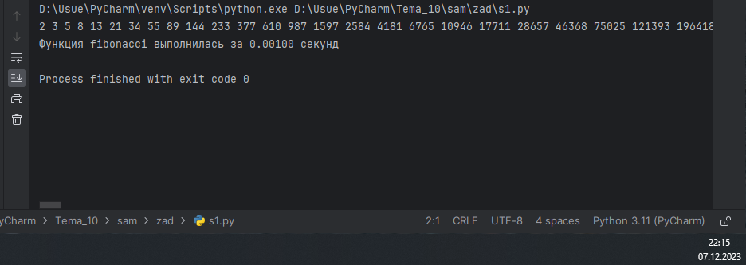
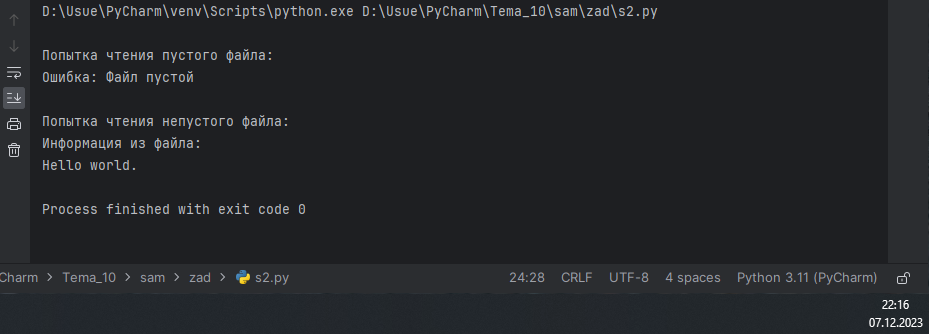
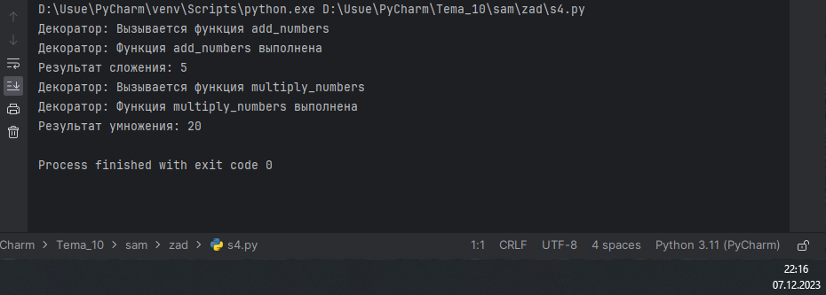
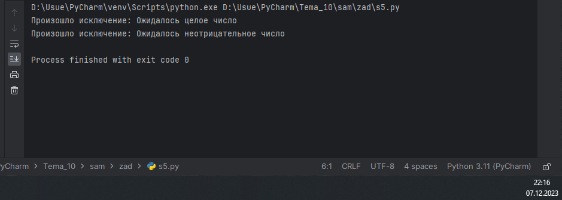

# Тема 8. Работа с файлами (ввод, вывод)
Отчет по Теме #8 выполнил(а):
- Артюшин Вадим Борисович
- ОЗИВТ(ППК)-22-2-у

| Задание | Лаб_раб | Сам_раб |
| ------ | ------ | ------ |
| Задание 1 | + | + |
| Задание 2 | + | + |
| Задание 3 | + | + |
| Задание 4 | + | + |
| Задание 5 | + | + |
| Задание 6 | - | - |
| Задание 7 | - | - |
| Задание 8 | - | - |
| Задание 9 | - | - |
| Задание 10 | - | - |

знак "+" - задание выполнено; знак "-" - задание не выполнено;

Работу проверили:
- к.э.н., доцент Панов М.А.

## Лабораторная работа №1
### Создайте класс “Car” с атрибутами производитель и модель. Создайте объект этого класса. Напишите комментарии для кода, объясняющие его работу. Результатом выполнения задания будет листинг кода с комментариями.

```python
class Car: #Класс для представления автомобиля.
    def __init__(self, make, model): #Метод инициализации с параметрами: марка и модель автомобиля.
        self.make = make    #Свойство класса для хранения марки автомобиля.
        self.model = model  #Свойство класса для хранения модели автомобиля.

my_car = Car("Toyota", "Trueno") #Создаем экземпляр класса Car с маркой Toyota и моделью Trueno.
```

### Результат.


## Выводы

Была создана папка и текстовый файл.

## Лабораторная работа №2
### Напишите программу, которая выведет только первую строку из вашего файла, при этом используйте конструкцию open()/close().

```python
f = open('input.txt', 'r')
print(f.readline())
f.close()
```
### Результат.


## Выводы

В данном коде выводятся одна строка с использованием функции `print()`. Каждая строка содержит разные значения:

1. `print(f.readline())`: Выводится первая строка. 

## Лабораторная работа №3
### Напишите программу, которая выведет все строки из вашего файла в массиве, при этом используйте конструкцию open()/close().

```python
f = open('input.txt', 'r')
print(f.readlines())
f.close()
```
### Результат.


## Выводы

В данном коде выводятся одна строка с использованием функции `print()`. Каждая строка содержит разные значения:

1. `print(f.readlines())`: Выводится выводит все строки. 


## Лабораторная работа №4
### Напишите программу, которая выведет все строки из вашего файла в массиве, при этом используйте конструкцию with open().
```python
with open('input.txt') as f:
	print(f.readlines())
```
### Результат.


## Выводы

В данном коде выводятся одна строка с использованием функции `print()`. Каждая строка содержит разные значения:

1. `print(f.readlines())`: Выводится выводит все строки.

## Лабораторная работа №5
### Напишите программу, которая выведет каждую строку из вашего файла отдельно, при этом используйте конструкцию with open().

```python
with open('input.txt') as f:
	for line in f:
		print(line)
```
### Результат.


## Самостоятельная работа №1
### Найдите в интернете любую статью (объем статьи не менее 200 слов), скопируйте ее содержимое в файл и напишите программу, которая считает количество слов в текстовом файле и определит
самое часто встречающееся слово. Результатом выполнения задачи будет: скриншот файла со статьей, листинг кода, и вывод в консоле в котором будет указана вся необходимая информация.

```python
def main():
    with open("words.txt", encoding="utf8") as file:
        text = file.read()
        words = text.split()
        word_count = {word: words.count(word) for word in set(words)}
        max_count = max(word_count, key=word_count.get)

    print(f"Самое частое слово: {max_count}, количество: {word_count[max_count]}")

if __name__ == "__main__":
    main()
```
### Результат.


## Выводы

В данном коде выводятся одна строка с использованием функции `print()`. Каждая строка содержит разные значения:

1. `print(f"Самое частое слово: {max_count}, количество: {word_count[max_count]}")`: Выводится частое слово и количество.

## Самостоятельная работа №2
### У вас появилась потребность в ведение книги расходов, посмотрев все существующие варианты вы пришли к выводу что вас ничего не
устраивает и нужно все делать самому. Напишите программу для учета расходов. Программа должна позволять вводить информацию
о расходах, сохранять ее в файл и выводить существующие данные в консоль. Ввод информации происходит через консоль. Результатом
выполнения задачи будет: скриншот файла с учетом расходов, листинг кода, и вывод в консоль, с демонстрацией работоспособности программы.

```python
def read_data():
    try:
        with open("transactions.txt", "r") as file:
            data = file.read()
            return data
    except FileNotFoundError:
        return "Нет данных для чтения!"

def write_data(data):
    try:
        with open("transactions.txt", "w") as file:
            file.write(data)
    except PermissionError:
        print("Ошибка разрешения! Пожалуйста, повторите попытку позже.")

def main():
    data = read_data()
    transactions = data.split("\n")
    print("Текущие операции: ")
    for transaction in transactions:
        if transaction != "":
            print(transaction)
        else:
            pass

    while True:
        amount = input("Введите сумму транзакции (Enter для выхода): ")
        if amount == "":
            break
        transactions.append(amount)
        write_data("\n".join(transactions))
        print(f"Добавлена транзакция:  {amount}")

if __name__ == "__main__":
    main()
```
### Результат.


## Выводы

В данном коде выводятся одна строка с использованием функции `print()`. Каждая строка содержит разные значения:

1. `print(f"Добавлена транзакция:  {amount}")`: Выводится добавлена транзакция.
  
## Самостоятельная работа №3
### Имеется файл input.txt с текстом на латинице. Напишите программу, которая выводит следующую статистику по тексту: количество букв
латинского алфавита; число слов; число строк. 
### Текст в файле:
Beautiful is better than ugly.
Explicit is better than implicit.
Simple is better than complex.
Complex is better than complicated.
### Ожидаемый результат:
Input file contains:
108 letters
20 words
4 lines

```python
def main():
    filename = 'input.txt'
    letters, words, lines = 0, 0, 0
    with open(filename, 'r') as file:
        for line in file:
            letters += len(line)
            words += len(line.split())
            lines += 1
    print(f'Input file contains:\n{letters} letters\n{words} words\n{lines} lines')

if __name__ == '__main__':
    main()
```
### Результат.


## Выводы

В данном коде выводятся одна строка с использованием функции `print()`. Строка содержит значения:

1. `print(f'Input file contains:\n{letters} letters\n{words} words\n{lines} lines')`: Выводится количество символов, слов и строк. 
  
## Самостоятельная работа №4
### Напишите программу, которая получает на вход предложение, выводит его в терминал, заменяя все запрещенные слова звездочками * (количество звездочек равно количеству букв в
слове). Запрещенные слова, разделенные символом пробела, хранятся в текстовом файле input.txt. Все слова в этом файле записаны в нижнем регистре. Программа должна заменить
запрещенные слова, где бы они ни встречались, даже в середине другого слова. Замена производится независимо от регистра: если файл input.txt содержит запрещенное слово exam, то слова exam,
Exam, ExaM, EXAM и exAm должны быть заменены на ****.
### Запрещенные слова:
hello email python the exam work is
### Предложение для проверки:
Hello, world! Python IS the programming language of thE future. My
EMAIL is…
PYTHON is awesome!!!!
•Ожидаемый результат:
***** ***Id! ****** ** *** programming language of *** future. My
***** **
****** **
awesome!!!!
```python
def censore(sentence):
	words = open('input1.txt','r').read().lower().split() #открываем файл и записываем все слова в список
	for word in words: #проходимся по всем словам в списке
		sentence = sentence.replace(word, '*'*len(word)) #если слово встречается в предложении, то заменяем его
	return sentence
print(censore(input())) #выводим предложение с замененными словами
```
### Результат.


## Выводы

В данном коде выводятся одна строка с использованием функции `print()`. Каждая строка содержит разные значения:

1. `print(censore(input()))`: Выводится предложение с замененными словами.
  
## Самостоятельная работа №5
### Самостоятельно придумайте и решите задачу, которая будет взаимодействовать с текстовым файлом. 
### Программу для подсчета символов в текстовом файле.

```python
file = open("file.txt", "r")
content = file.read()

characters = len(content)
print("В файле", characters, "символов.")
file.close()
```
### Результат.

  
## Выводы

В данном коде выводятся одна строка с использованием функции `print()`. Каждая строка содержит разные значения:

1. `print("В файле", characters, "символов.")`: Выводится количество символов в файле.

## Общие выводы по теме
Python позволяет работать с файлами различными способами, такими как чтение, запись, добавление и удаление данных. Для работы с файлами можно использовать встроенные функции, такие как open(), close() и read(), или модули, такие как os и io. Кроме того, Python поддерживает различные режимы доступа к файлам, такие как “r” для чтения, “w” для записи и “a” для добавления данных.
