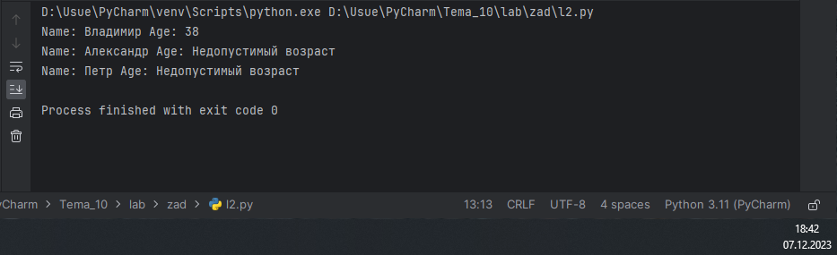
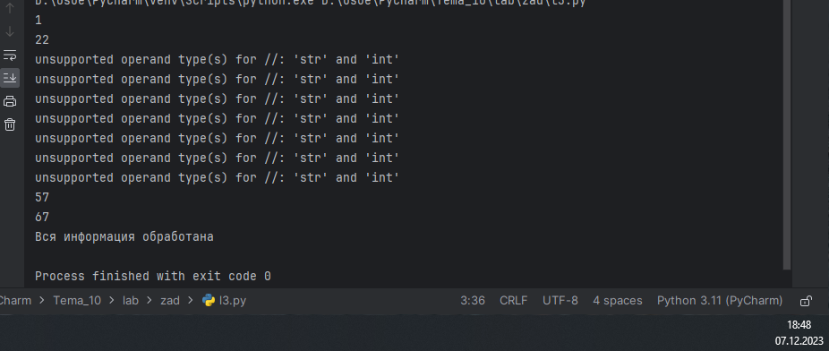
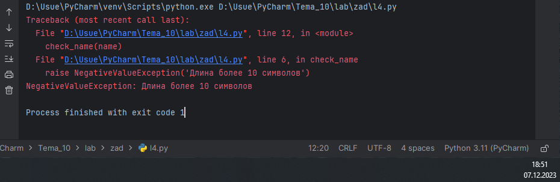
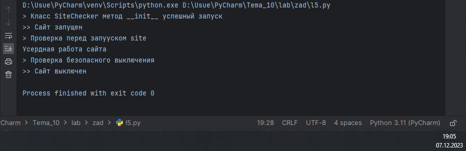

# Тема 9.ООП на Python: концепции, принципы и примеры реализации.
Отчет по Теме #9 выполнил(а):
- Артюшин Вадим Борисович
- ОЗИВТ(ППК)-22-2-у

| Задание | Лаб_раб | Сам_раб |
| ------ | ------ | ------ |
| Задание 1 | + | + |
| Задание 2 | + | - |
| Задание 3 | + | - |
| Задание 4 | + | - |
| Задание 5 | + | - |
| Задание 6 | - | - |
| Задание 7 | - | - |
| Задание 8 | - | - |
| Задание 9 | - | - |
| Задание 10 | - | - |

знак "+" - задание выполнено; знак "-" - задание не выполнено;

Работу проверили:
- к.э.н., доцент Панов М.А.

## Лабораторная работа №1
### Создайте класс “Car” с атрибутами производитель и модель. Создайте объект этого класса. Напишите комментарии для кода, объясняющие его работу. Результатом выполнения задания будет листинг кода с комментариями.

```python
class Ivan:
    __slots__ = ['name']

    def __init__(self, name):
        if name == 'Иван':
            self.name = f"Да, я {name}"
        else:
            self.name = f"Я не {name}, а Иван"

person1 = Ivan('Алексей')
person2 = Ivan('Иван')
print(person1.name)
print(person2.name)

person2.surname = 'Петров'
```

### Результат.


## Выводы
В данном коде выводятся две строки с использованием функции `print()`. Каждая строка содержит разные значения:

1. `print(person1.name)`: Выводится предложение.
2. `print(person2.name)`: Выводится предложение.

## Лабораторная работа №2
### Дополните код из первого задания, добавив в него атрибуты и методы класса, заставьте машину “поехать”. Напишите комментарии для кода, объясняющие его работу. Результатом выполнения задания будет листинг кода с комментариями и получившийся вывод в консоль.

```python
class Icecream:
    def __init__(self, ingredient=None):
        if isinstance(ingredient, str):
            self.ingredient = ingredient
        else:
            self.ingredient = None

    def composition(self):
        if self.ingredient:
            print(f"Мороженое с {self.ingredient}")
        else:
            print('Обычное мороженое')

icecream = Icecream()
icecream.composition()
icecream = Icecream('шоколадом')
icecream.composition()
icecream = Icecream(5)
icecream.composition()
```
### Результат.


## Выводы

В данном коде выводятся три строки с использованием функции `print()`. Каждая строка содержит разные значения:

1. `icecream.composition()`: Выводится предложение.
2. `icecream.composition()`: Выводится предложение.
3. `icecream.composition()`: Выводится предложение. 

## Лабораторная работа №3
### Создайте новый класс “ElectricCar” с методом “charge” и атрибутом емкость батареи. Реализуйте его наследование от класса, созданного в первом задании. Заставьте машину поехать, а потом заряжаться. Михаил А. Панов Напишите комментарии для кода, объясняющие его работу. Результатом выполнения задания будет листинг кода с комментариями и получившийся вывод в консоль

```python
class MyClass:
    def __init__(self, value):
        self._value = value

    def set_value(self, value):
        self._value = value

    def get_value(self):
        return self._value

    def del_value(self):
        del self._value

    value = property(get_value, set_value, del_value, "Свойство value")

obj = MyClass(42)
print(obj.get_value())
obj.set_value(45)
print(obj.get_value())
obj.set_value(100)
print(obj.get_value())
obj.del_value()
print(obj.get_value())
```
### Результат.


## Выводы

В данном коде выводятся три строки с использованием функции `print()`. Каждая строка содержит разные значения:

1. `obj = MyClass(42)`: Выводится значение.
2. `obj = MyClass(45)`: Выводится значение.
3. `obj = MyClass(100)`: Выводится значение.

## Лабораторная работа №4
### Реализуйте инкапсуляцию для класса, созданного в первом задании. Создайте защищенный атрибут производителя и приватный атрибут модели. Вызовите защищенный атрибут и заставьте машину поехать. Напишите комментарии для кода, объясняющие его работу. Результатом выполнения задания будет листинг кода с комментариями и получившийся вывод в консоль.
```python
class Mammal:
    className = 'Mammal'

class Dog(Mammal):
    species = 'canine'
    sounds = 'wow'

class Cat(Mammal):
    species = 'feline'
    sounds = 'meow'

dog = Dog()
print(f"Dog is {dog.className}, but they say {dog.sounds}")
cat = Cat()
print(f"Cat is {cat.className}, but they say {cat.sounds}")
```
### Результат.


## Выводы

В данном коде выводятся две строки с использованием функции `print()`. Каждая строка содержит разные значения:

1. `print(f"Dog is {dog.className}, but they say {dog.sounds}")`: Выводится предложение.
2. `print(f"Cat is {cat.className}, but they say {cat.sounds}")`: Выводится предложение.

## Лабораторная работа №5
### Реализуйте полиморфизм создав основной (общий) класс “Shape”, а также еще два класса “Rectangle” и “Circle”. Внутри последних двух классов реализуйте методы для подсчета площади фигуры. После этого создайте массив с фигурами, поместите туда круг и прямоугольник, затем при помощи цикла выведите их площади. Напишите комментарии для кода, объясняющие его работу. Результатом выполнения задания будет листинг кода с комментариями и получившийся вывод в консоль.

```python
class Russian:
    @staticmethod
    def greeting():
        print("Привет")

class English:
    @staticmethod
    def greeting():
        print("Hello")

def greet(language):
    language.greeting()

ivan = Russian()
greet(ivan)
john = English()
greet(john)
```
### Результат.


## Выводы

В данном коде выводятся две строки с использованием функции `print()`. Каждая строка содержит разные значения:

1. `print("Привет")`: Выводится слово.
2. `print("Hello")`: Выводится слово.

## Самостоятельная работа №1
### Самостоятельно создайте класс и его объект. Они должны отличаться, от тех, что указаны в теоретическом материале (методичке) и лабораторных заданиях. Результатом выполнения задания будет листинг кода и получившийся вывод консоли.

```python
class Tomato:
    states = {'unripe': 0, 'ripe': 1, 'overripe': 2}

    def __init__(self, index):
        self._index = index
        self._state = self.states['unripe']

    def grow(self):
        if self._state == self.states['ripe']:
            return "Can't grow overripe tomato"
        else:
            next_state = self._state if self._state == 'overripe' else self._state + 1
            self._state = next_state
            return f"Grown tomato #{self._index} from '{self._state}' to '{next_state}'"

    def is_ripe(self):
        return self._state == self.states['ripe']


class TomatoBush:
    def __init__(self, num_tomatoes):
        self.tomatoes = [Tomato(i) for i in range(1, num_tomatoes + 1)]

    def grow_all(self):
        for tomato in self.tomatoes:
            tomato.grow()

    def are_all_ripe(self):
        return all(tomato.is_ripe() for tomato in self.tomatoes)

    def give_away_all(self):
        self.tomatoes = []


class Gardener:
    def __init__(self, name: str, plant: TomatoBush):
        self.__name = name
        self.__plant = plant

    @property
    def name(self) -> str:
        return self.__name

    @property
    def plant(self) -> TomatoBush:
        return self.__plant

    def work(self) -> None:
        self.__plant.grow_all()

    def harvest(self) -> bool:
        if not self.plant.are_all_ripe():
            print('Warning: not all fruits are ripe!')
            return False
        else:
            print(f'Harvesting from plant {self.plant}')
            return True

    @staticmethod
    def knowledge_base() -> None:
        print('The static method knowledge_base prints information about gardening.')


gardener = Gardener("John", TomatoBush(5))
gardener.work()
print(gardener.harvest())
```
### Результат.


В данном коде выводятся одна строка с использованием функции `print`. Каждая строка содержит разные значения:

1. `print(gardener.harvest())`: Выводится предложение.

## Общие выводы по теме
“Объектно-ориентированное программирование (ООП) в Python включает использование классов и объектов для представления данных и логики. Концепции, такие как инкапсуляция, наследование и полиморфизм, помогают организовать и структурировать код. ООП позволяет упростить разработку, обеспечить повторное использование кода и повысить безопасность данных.”
